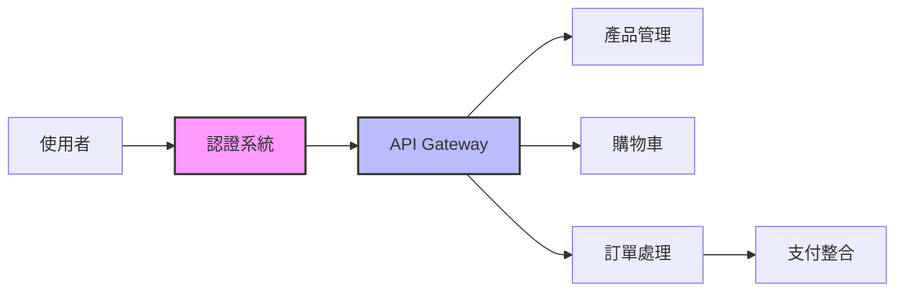
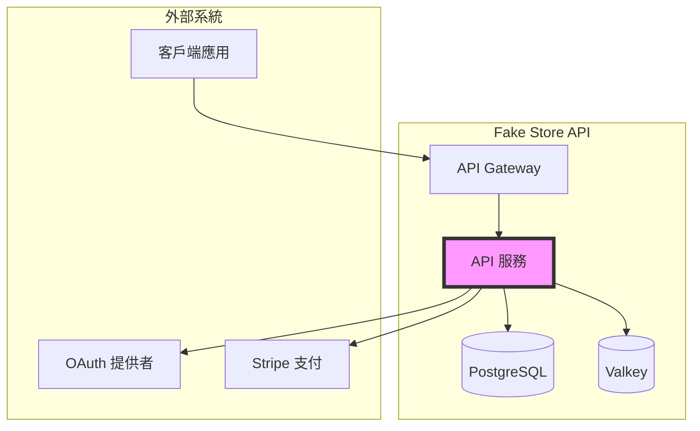
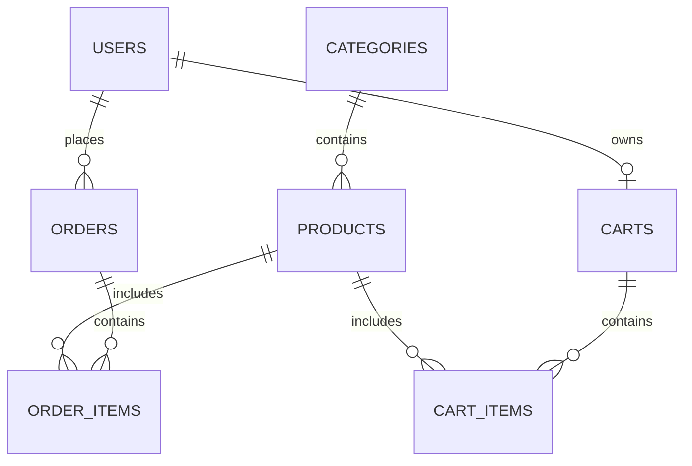

# Fake Store API - 產品需求文件 (PRD) v1.0

**文件版本:** 1.0 **最後更新:** 2025-08-20

> 📚 完整文件導航請參考 [文件中心](docs/README.md)

## 執行摘要

Fake Store API 是一個功能完整的模擬電子商務 API 服務，專為個人學習和開發練習而設計。本專案採用 Spec-Driven Development 方法，提供清晰的規格文件和高品質的實作範例。

## 1. 專案概觀

### 1.1 專案資訊
- **專案名稱:** Fake Store API
- **版本:** v1.0
- **狀態:** 開發中
- **團隊:** 個人練習專案

### 1.2 核心價值主張
- 🎯 **學習導向**: 完整展示現代後端開發最佳實踐
- 📖 **文件完整**: 從需求到實作的完整文件
- 🔧 **技術先進**: 採用 Java 21、Spring Boot WebFlux 等現代技術
- 🚀 **易於部署**: Docker 容器化，一鍵部署

### 1.3 目標使用者
- 後端開發學習者
- API 設計實踐者
- 全端開發工程師
- 技術面試準備者

## 2. 專案目標

### 2.1 學習目標
- ✅ 掌握完整的 CRUD 操作實作
- ✅ 學習 JWT 和 OAuth 2.0 認證機制
- ✅ 整合第三方支付服務 (Stripe)
- ✅ 實作資料查詢、篩選、排序和分頁
- ✅ 理解 RESTful API 設計原則
- ✅ 掌握容器化部署流程

### 2.2 技術目標
- 建立響應式 API 服務 (Spring WebFlux)
- 實作完整的認證授權系統
- 整合關聯式資料庫 (PostgreSQL)
- 實作快取機制 (Valkey)
- 建立監控告警系統
- 達成 80% 以上測試覆蓋率
- **導入 ArchUnit 架構測試，確保模組邊界與設計原則**

### 2.3 成功指標
| 指標 | 目標值 | 測量方法 |
|------|--------|----------|
| API 回應時間 | < 500ms (P95) | Prometheus 監控 |
| 系統可用性 | > 99.5% | 健康檢查 |
| 測試覆蓋率 | > 80% | JaCoCo 報告 |
| 文件完整度 | 100% API 文件化 | OpenAPI 規範 |
| 程式碼品質 | A 級 | SonarQube 分析 |

## 3. 核心功能需求

### 3.1 功能模組概覽



### 3.2 核心功能清單

| 模組 | 功能 | 優先級 | 狀態 |
|------|------|--------|------|
| **產品管理** | 產品 CRUD、查詢、篩選 | P0 | 🟢 規劃中 |
| **分類系統** | 分類管理、階層結構 | P0 | 🟢 規劃中 |
| **使用者系統** | 註冊、登入、個人資料 | P0 | 🟢 規劃中 |
| **認證授權** | JWT、OAuth 2.0、權限控制 | P0 | 🟢 規劃中 |
| **購物車** | 加入、更新、移除商品 | P1 | 🟡 待開發 |
| **訂單管理** | 建立訂單、狀態追蹤 | P1 | 🟡 待開發 |
| **支付整合** | Stripe 整合、Webhook | P2 | 🔴 未開始 |

> 📋 詳細功能規格請參考 [功能需求文件](docs/requirements/functional.md)

備註（使用者與認證策略）
- 註冊策略：以 Google/GitHub OAuth 為優先；教學用途保留帳密登入；一般註冊視需求追加。
- API Key：登入後可建立 API Key；API Key 與 JWT 皆透過 `Authorization: Bearer <token>` 傳遞（前綴判別）。
- 對賬策略：支付前建立「待支付」訂單，將 `order_id` 放入 Stripe metadata；以 Webhook 事件更新訂單狀態（詳見[監控與對賬](docs/operations/monitoring.md)）。

## 4. 系統架構

### 4.1 技術堆疊
- **後端框架**: Spring Boot 3.x with WebFlux
- **程式語言**: Java 21
- **資料庫**: PostgreSQL 15+
- **快取**: Valkey (Redis-compatible)
- **容器化**: Docker & Docker Compose
- **API 閘道**: Spring Cloud Gateway
- **監控**: Prometheus + Grafana

> 🏗️ 完整架構設計請參考 [C4 架構模型](docs/architecture/c4-model.md)

### 4.2 系統架構圖



## 5. 資料模型

### 5.1 核心實體



### 5.2 主要資料表
- `users` - 使用者資料
- `products` - 產品資料
- `categories` - 產品分類
- `carts` - 購物車
- `orders` - 訂單
- `payments` - 支付記錄

> 💾 詳細資料庫設計請參考 [資料庫架構文件](docs/architecture/database-schema.md)

## 6. API 設計原則

### 6.1 設計標準
- ✅ 遵循 RESTful 設計原則
- ✅ 採用 Google AIP 標準
- ✅ 使用 OpenAPI 3.0 規範
- ✅ 實作版本控制策略
- ✅ 統一錯誤處理格式

- 對應 AIP 條款（落地準則）
  - AIP-132/131：資源列表/單筆（如 `GET /products`、`GET /categories/{id}/products`）。
  - AIP-134：更新以 `PATCH` 為準，支援 `update_mask`（query）進行部分欄位更新。
  - AIP-136：自訂方法以 `:verb` 命名（如 `/payments:createCheckoutSession`、`/users/me/cart:clear`、事件操作）。
  - AIP-160：結構化篩選/排序/分頁；互斥參數（如 `include_deleted`/`only_deleted`）違規時回 `INVALID_ARGUMENT`。
- AIP-193：統一錯誤格式（errors.details/badRequest.field_violations）。

### 6.2 API 端點範例
```
GET    /v1/products          # 產品列表
GET    /v1/products/{id}     # 產品詳情
POST   /v1/products          # 新增產品 (需管理員權限)
PATCH  /v1/products/{id}     # 更新產品 (需管理員權限, 支援 updateMask)
DELETE /v1/products/{id}     # 刪除產品 (需管理員權限)

GET    /v1/categories/{id}/products   # 分類子資源列表（AIP-132）

POST   /v1/auth/login        # 使用者登入（帳密登入，教學用）
POST   /v1/auth/refresh      # 更新 Token
GET    /v1/auth/google       # Google OAuth 授權
GET    /v1/auth/google/callback # Google OAuth 回調

POST   /v1/payments:createCheckoutSession  # 建立 Stripe Checkout（回 checkout_url）
POST   /v1/users/me/cart:clear   # 自訂方法清空購物車（AIP-136）
POST   /v1/users/me/cart:checkout# 自訂方法購物車結帳（AIP-136）

GET    /v1/users/me          # 當前使用者資訊
GET    /v1/users/me/cart     # 購物車內容
POST   /v1/users/me/cart/items  # 加入購物車
```

> 🔌 完整 API 文件請參考 [API 設計規格](docs/api/design-spec.md)

## 7. 非功能需求摘要

### 7.1 效能需求
- API 回應時間 < 500ms (P95)
- 支援 100 QPS 持續流量
- 支援 500 併發使用者

### 7.2 安全需求
- HTTPS 加密傳輸
- JWT Token 認證
- 認證策略包含 JWT 與 API Key（皆走 `Authorization: Bearer <token>`）
- 密碼 BCrypt 加密
- API 限流保護

### 7.3 可用性需求
- 系統可用性 > 99.5%
- 自動健康檢查
- 容器自動重啟
- 資料定期備份
- 服務無狀態化 + 快取（Valkey）以支撐延展與效能

> 📊 詳細非功能需求請參考 [非功能需求文件](docs/requirements/non-functional.md)

## 8. 專案里程碑

### Phase 1: 基礎建設 (第 1-2 週)
- [x] 專案架構設計
- [x] 文件規劃
- [ ] 開發環境設置
- [ ] 資料庫設計實作

### Phase 2: 核心功能 (第 3-4 週)
- [ ] 產品管理 API
- [ ] 使用者認證系統
- [ ] 購物車功能
- [ ] 基本測試覆蓋

### Phase 3: 進階功能 (第 5-6 週)
- [ ] OAuth 2.0 整合
- [ ] 訂單管理系統
- [ ] 支付整合 (Stripe)
- [ ] API 限流實作

### Phase 4: 部署與最佳化 (第 7-8 週)
- [ ] Docker 容器化
- [ ] 監控系統建立
- [ ] 效能最佳化
- [ ] 文件完善

## 9. 風險與挑戰

| 風險 | 影響 | 緩解策略 |
|------|------|----------|
| 技術學習曲線陡峭 | 開發進度延遲 | 準備充足學習資源 |
| 第三方服務整合複雜 | 功能實作困難 | 使用沙盒環境測試 |
| 效能瓶頸 | 使用者體驗差 | 實作快取和最佳化 |
| 安全漏洞 | 資料外洩風險 | 遵循安全最佳實踐 |

## 10. 相關文件

### 需求與設計
- 📋 [功能需求詳細說明](docs/requirements/functional.md)
- 📊 [非功能需求規範](docs/requirements/non-functional.md)
- 🏗️ [系統架構設計](docs/architecture/c4-model.md)
- 💾 [資料庫設計](docs/architecture/database-schema.md)

### API 與實作
- 🔌 [API 設計規格](docs/api/design-spec.md)
- 🔐 [認證授權設計](docs/api/authentication.md)
- 💻 [程式碼範例](docs/examples/)
- 🧪 [測試策略](docs/implementation/testing-strategy.md)

### 部署與運維
- 🚀 [部署架構](docs/operations/deployment.md)
- 📊 [監控系統](docs/operations/monitoring.md)
- 💾 [備份策略](docs/operations/backup-recovery.md)

### 學習資源
- 📚 [快速開始指南](docs/guides/getting-started.md)
- 🎓 [學習路徑](docs/guides/learning-guide.md)
- 📖 [術語對照表](docs/terminology.md)

## 聯絡資訊

- **GitHub**: [kehao-chen/fake-store-api](https://github.com/kehao-chen/fake-store-api)
- **Email**: support@fakestore.happyhacking.ninja
- **文件中心**: [docs/README.md](docs/README.md)

---

*本文件是 Fake Store API 專案的核心產品需求文件，技術實作細節請參考相關子文件。*

*最後更新: 2025-08-20 | 版本: 1.0*
