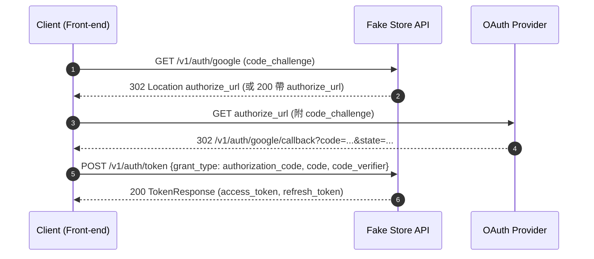
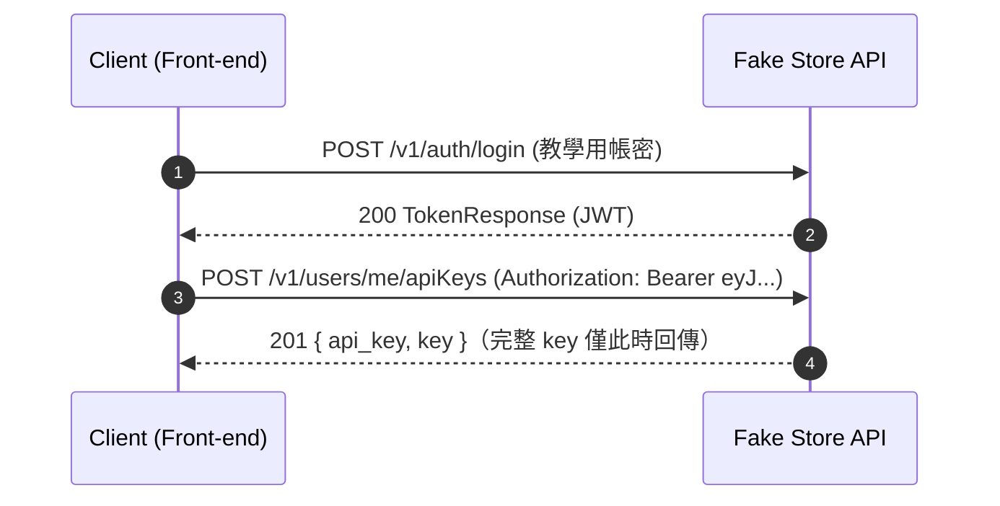

# 認證與授權（原則與流程）

本專案採用 **RS256 JWT** 與 **JWK** 標準，配合 OAuth2（授權碼 + PKCE）為主要註冊/登入方式；另提供教學用帳密登入與 API Key 構想，方便快速體驗。

## JWT 規格標準

### 令牌存活時間
- **Access Token**: 15 分鐘
- **Refresh Token**: 7 天

### 加密算法
- **演算法**: RS256 (RSA Signature with SHA-256)
- **金鑰管理**: 非對稱金鑰對 + JWK 端點
- **金鑰 ID**: 支援 `kid` 參數以便金鑰輪換

### JWK 端點
- **端點**: `GET /.well-known/jwks.json`
- **用途**: 提供公鑰資訊供 JWT 驗證
- **快取**: 公開可快取 1 小時

核心端點
- POST `/v1/auth/login`（教學用帳密登入，回傳 JWT）
- POST `/v1/auth/token`（交換 `authorization_code` / `refresh_token`）
- POST `/v1/auth/refresh`（刷新 token）
- GET  `/v1/auth/{provider}`（`google|github` 授權入口）
- GET  `/v1/auth/{provider}/callback`（回調，回傳 `code/state`）
- **GET  `/.well-known/jwks.json`（JWK 公鑰端點）**

## 金鑰管理與安全

### RSA 金鑰對配置
```yaml
jwt:
  private-key: classpath:keys/private_key_pkcs8.pem  # PKCS#8 格式私鑰
  public-key: classpath:keys/public_key.pem          # X.509 格式公鑰
  key-id: fake-store-key-1                           # 金鑰 ID (支援金鑰輪換)
  issuer: fake-store-api
  access-token-expiration: 15    # 分鐘
  refresh-token-expiration: 10080 # 分鐘 (7天)
```

### 金鑰生成命令
```bash
# 生成 RSA 私鑰並轉換為 PKCS#8 格式
openssl genrsa -out private_key.pem 2048
openssl pkcs8 -topk8 -inform PEM -outform PEM -in private_key.pem -out private_key_pkcs8.pem -nocrypt

# 生成對應的公鑰
openssl rsa -in private_key.pem -pubout -out public_key.pem
```

API Key（與 JWT 共用 Authorization 標頭）
- 使用 `Authorization: Bearer <token>` 傳遞憑證。
  - 值以 `eyJ` 開頭 → JWT（OAuth2 兌換所得）
  - 值以 `sk_` 等前綴 → API Key（僅建立時回傳完整 key）
- 端點安全可設為 OR（`OAuth2` 或 `ApiKeyBearer` 任一）。

API Key 管理端點
- GET  `/v1/users/me/apiKeys`（列表；只回前綴與中繼資料）
- POST `/v1/users/me/apiKeys`（建立；回完整 key + `api_key`）
- DELETE `/v1/users/me/apiKeys/{id}`（刪除/撤銷）

## OAuth2（PKCE）時序圖



## API Key 申請時序圖



OAuth2 + PKCE 流程摘要
1. 前端呼叫 GET `/auth/{provider}` 取得導向資訊或直接 302；產生 `code_challenge`（S256）。
2. Provider 重導到 `/auth/{provider}/callback?code=...&state=...`。
3. 前端攜帶 `code` 呼叫 POST `/auth/token` 兌換 JWT（`access/refresh`）。

帳密登入（教學用）
- 呼叫 POST `/auth/login` → 回傳 JWT；供未配置第三方登入者快速體驗。

API Key（擬定）
- 登入後於個人頁面或端點產生 `X-API-Key`（規格將補充 `ApiKeyAuth`）。

安全與合規（草案）
- Token Rotation 與撤銷（`/auth/refresh`）。
- OAuth scopes（`read/write/admin`）對應端點 `security`。
- 全域安全標頭（建議由 API Gateway 或全域 Filter 注入）：
  - `X-Content-Type-Options: nosniff`
  - `X-Frame-Options: DENY`
  - `Strict-Transport-Security: max-age=31536000; includeSubDomains`
  - `Referrer-Policy: strict-origin-when-cross-origin`
  - `Cache-Control: no-store`（於敏感回應）

審計欄位
- `created_by/updated_by/deleted_by` 由伺服器端依當前使用者（或 system）注入；schema 標示 `readOnly`。
