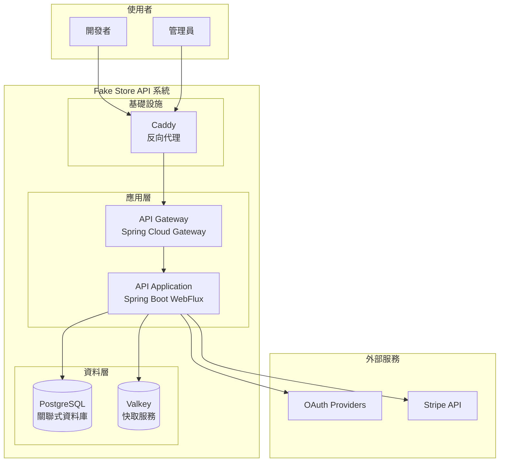
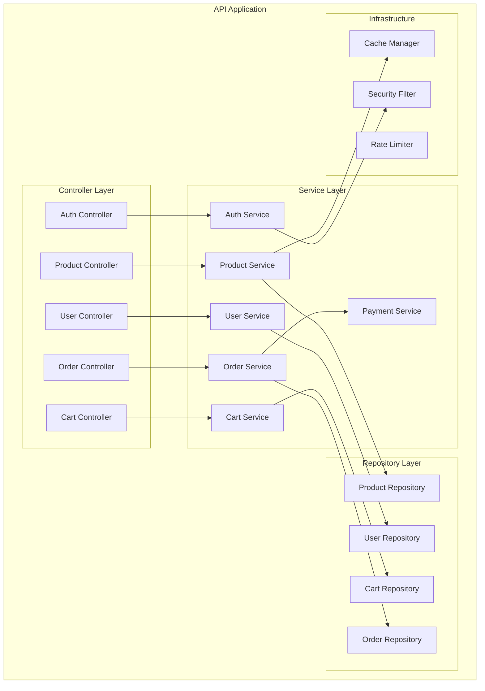
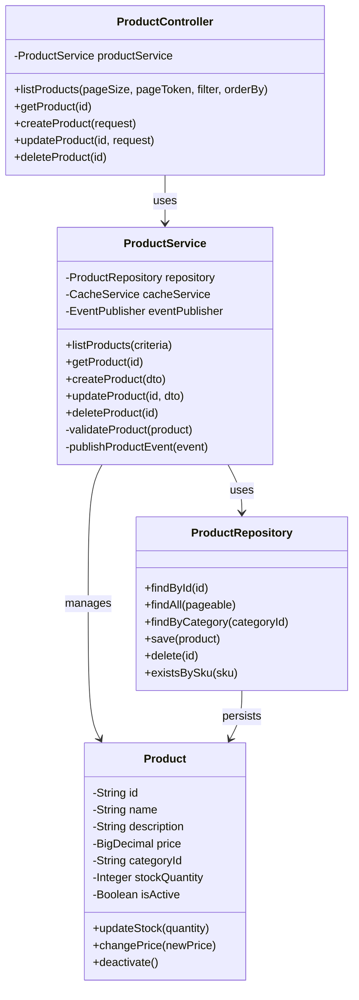
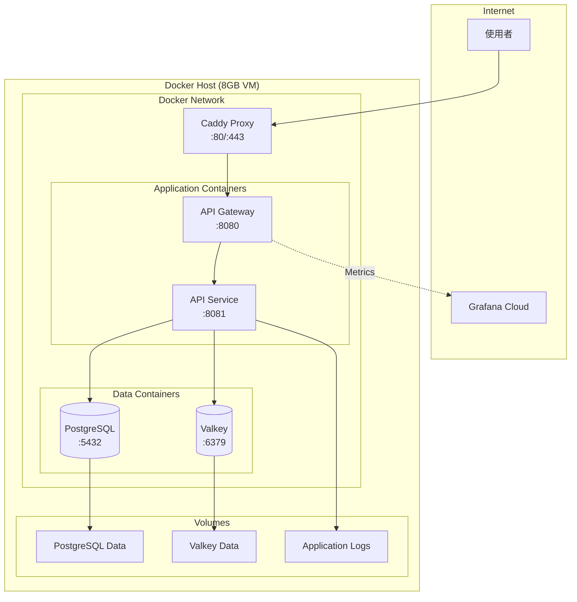

# C4 架構模型

[← 返回文件中心](../README.md) | **C4 架構模型**

## 文件資訊

- **版本**: 1.0.0
- **最後更新**: 2025-08-25
- **目標讀者**: 開發者, 架構師
- **相關文件**:
  - [DDD 領域模型](./ddd-model.md)
  - [資料流程圖](./data-flow.md)

本文件使用 C4 模型來描述 Fake Store API 的軟體架構，從不同層次展示系統結構。

## Level 1: 系統情境圖 (System Context Diagram)

展示系統與外部實體的互動關係。

```mermaid
graph TB
    subgraph "外部使用者"
        Developer[開發者<br/>使用 API 開發應用]
        Admin[管理員<br/>管理產品與訂單]
        EndUser[終端使用者<br/>透過開發者應用購物]
    end
    
    subgraph "Fake Store API 系統邊界"
        FakeStoreAPI[Fake Store API<br/>電商 API 服務]
    end
    
    subgraph "外部系統"
        GoogleOAuth[Google OAuth<br/>身份驗證服務]
        GitHubOAuth[GitHub OAuth<br/>身份驗證服務]
        Stripe[Stripe<br/>支付處理服務]
        EmailService[Email Service<br/>郵件通知服務]
    end
    
    Developer -->|API 請求| FakeStoreAPI
    Admin -->|管理操作| FakeStoreAPI
    EndUser -->|透過應用使用| Developer
    
    FakeStoreAPI -->|OAuth 認證| GoogleOAuth
    FakeStoreAPI -->|OAuth 認證| GitHubOAuth
    FakeStoreAPI -->|支付處理 (PaymentIntent/Checkout)| Stripe
    FakeStoreAPI -->|發送通知| EmailService
```

## Level 2: 容器圖 (Container Diagram)

展示系統內部的主要技術元件。



## Level 3: 元件圖 (Component Diagram)

展示應用程式內部的主要元件。



## Level 4: 程式碼圖 (Code Diagram)

展示關鍵類別的結構（以產品模組為例）。



## 架構決策記錄 (ADR)

### ADR-001: 使用響應式編程模型
- **決策**：採用 Spring WebFlux 而非傳統 Spring MVC
- **原因**：更好的資源利用率，適合高併發場景
- **影響**：需要團隊學習響應式編程概念

### ADR-002: 單體優先架構
- **決策**：初期採用模組化單體架構
- **原因**：降低複雜度，加快開發速度
- **影響**：未來可能需要拆分為微服務

### ADR-003: 使用 Valkey 作為快取層
- **決策**：選擇 Valkey 替代 Redis
- **原因**：開源許可更友好，功能相容
- **影響**：需要確保相容性測試

## 部署架構



## 關鍵架構特性

1. **高可用性**
   - 容器自動重啟
   - 健康檢查機制
   - 優雅關閉處理

2. **可擴展性**
   - 無狀態服務設計
   - 水平擴展準備
   - 快取策略最佳化

3. **安全性**
   - JWT 認證
   - OAuth 2.0 整合
   - API 限流保護

4. **可觀測性**
   - Prometheus 指標
   - 結構化日誌
   - 分散式追蹤準備

---

*本文件是 Fake Store API 專案的一部分*

*最後更新: 2025-08-25*
