# 資料流程圖

本文件描述 Fake Store API 系統中的資料流動模式和處理流程。

## 整體資料流架構

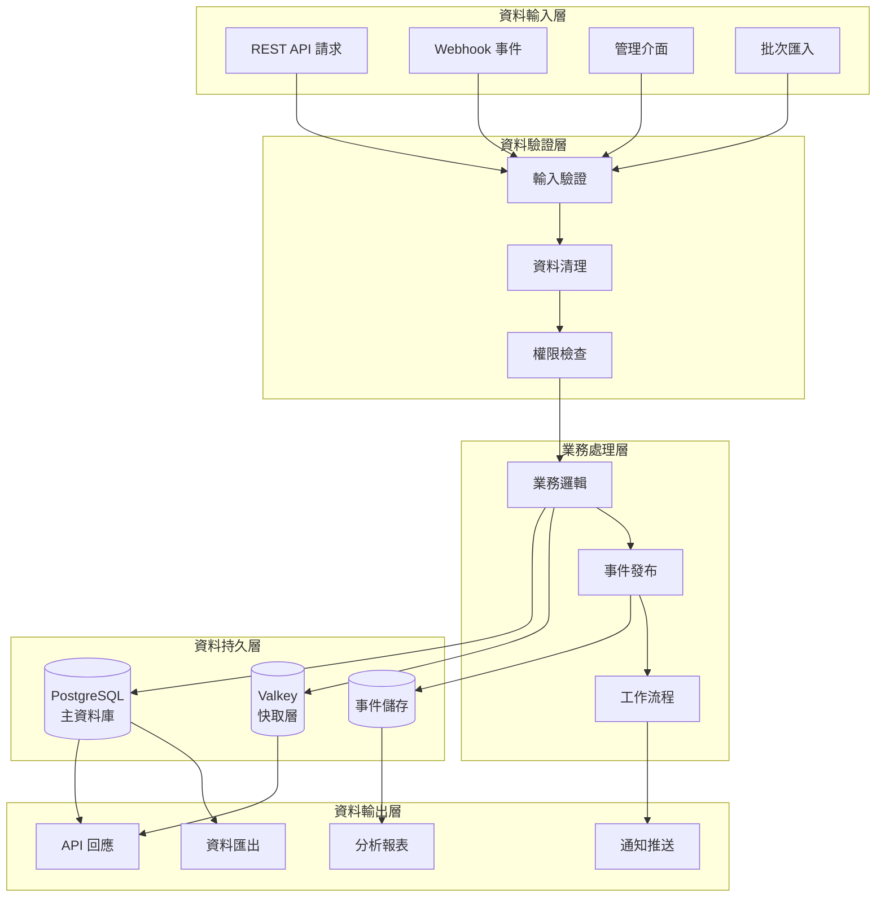

## 核心業務流程

### 1. 產品查詢流程

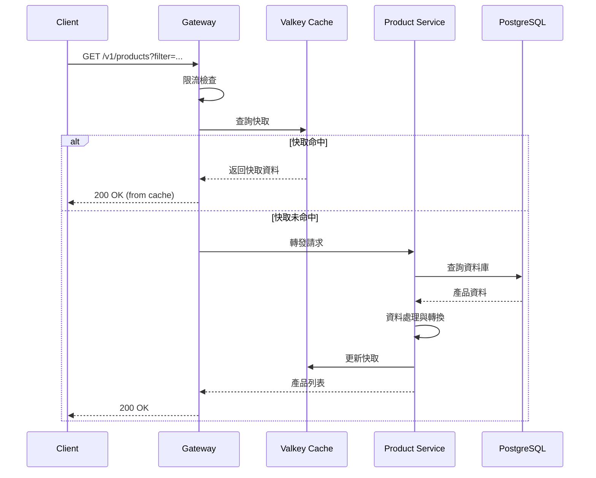

### 2. 訂單建立流程

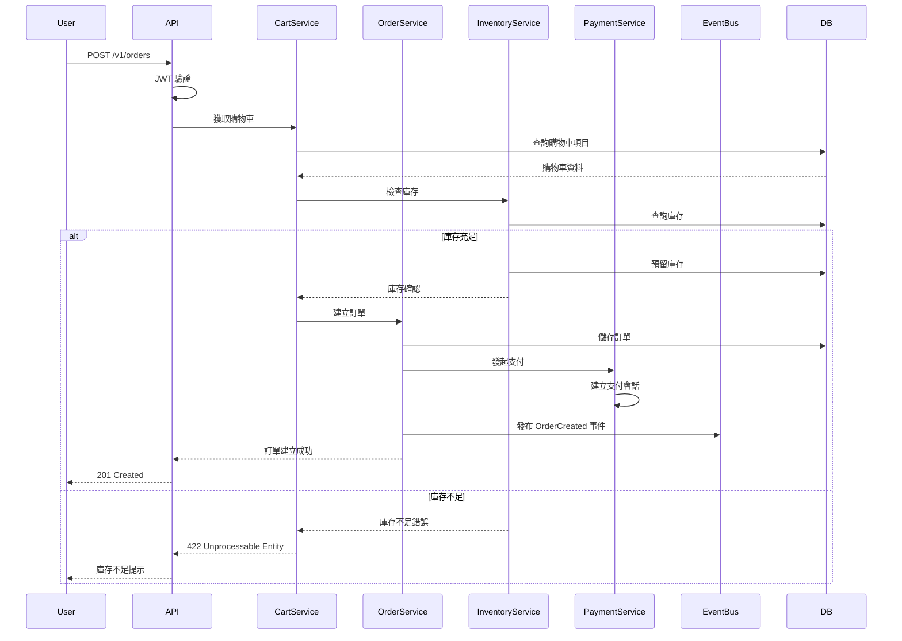

### 3. 使用者認證流程

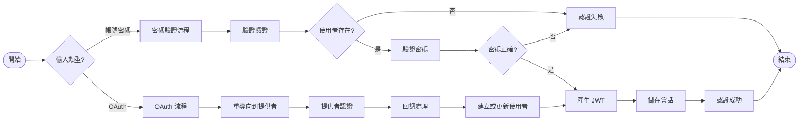

### 4. 支付流程（雙軌）

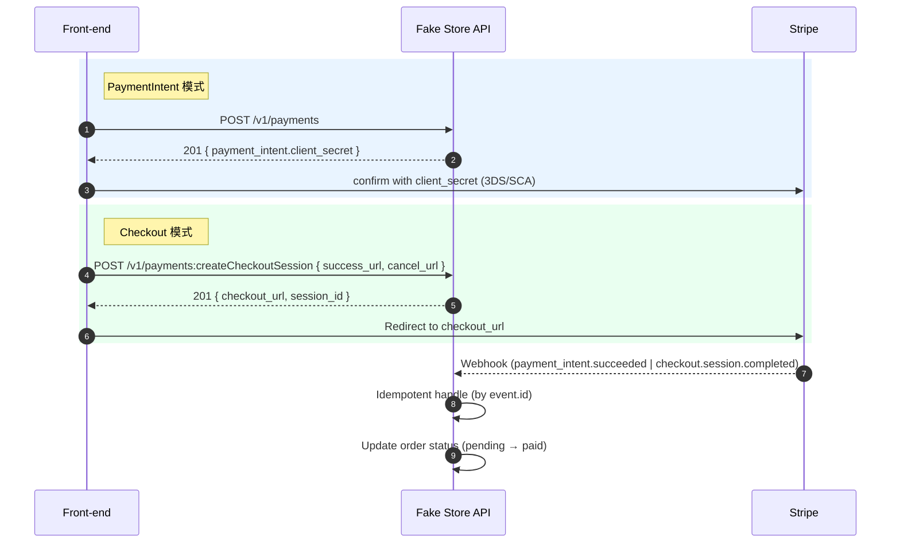

### 5. Saga 編排（含補償）

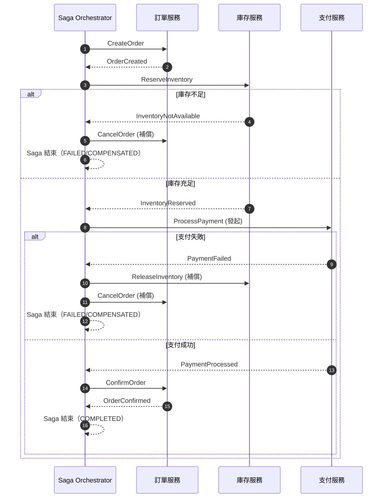

## 資料快取策略

### 快取層級架構

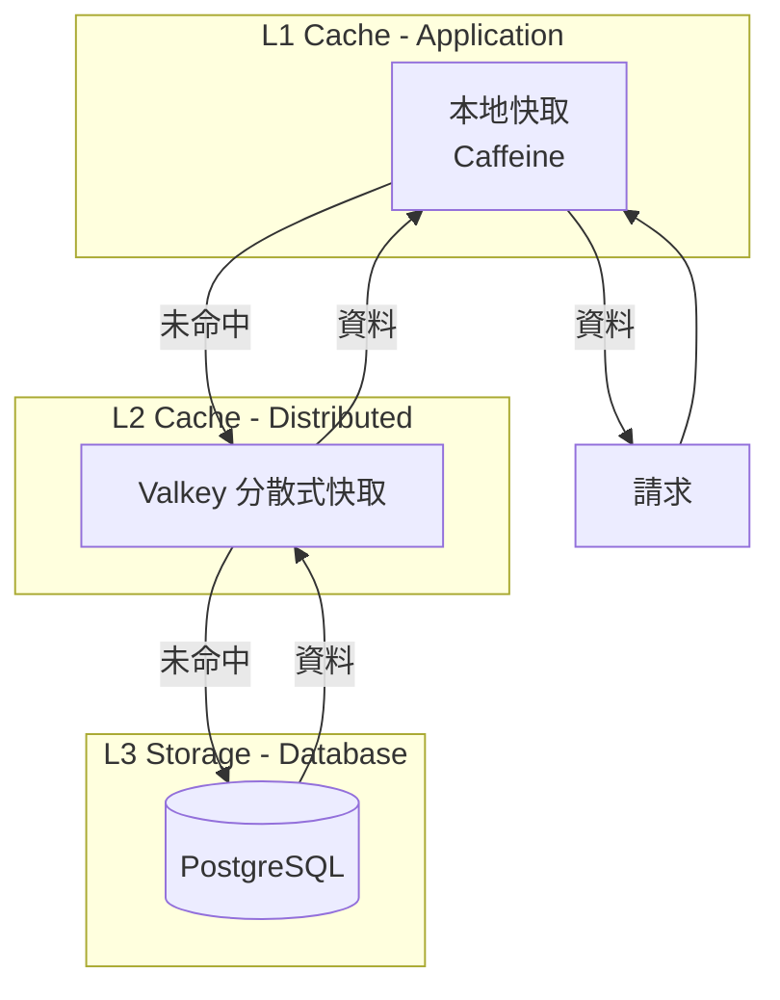

### 快取更新策略

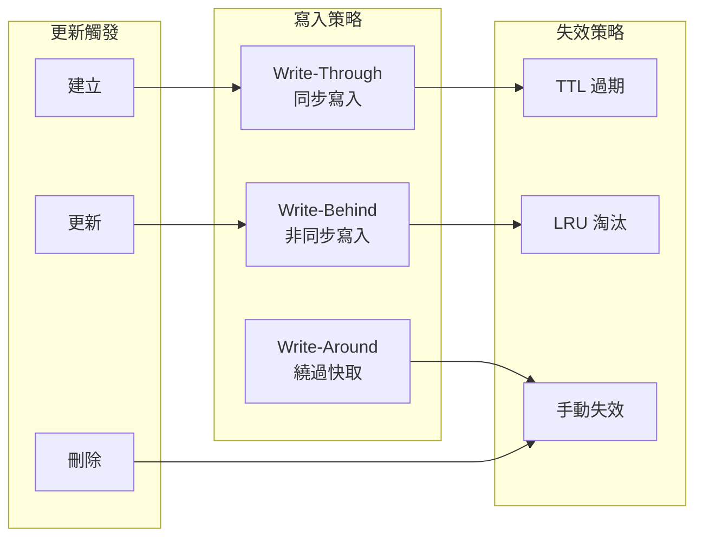

## 事件驅動資料流

### 事件發布訂閱模式

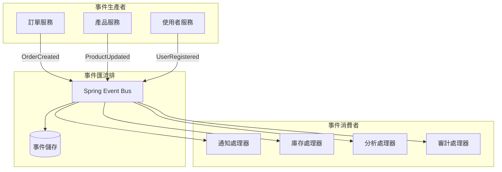

### 事件處理流程

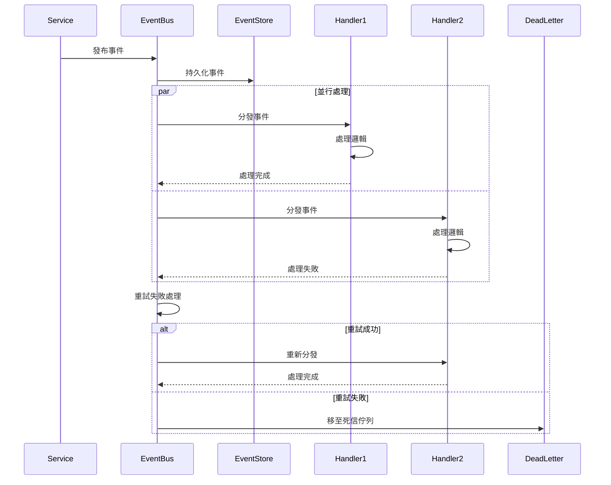

## 資料同步機制

### 快取與資料庫同步

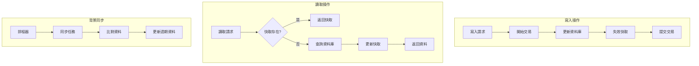

## 資料安全流程

### 敏感資料處理

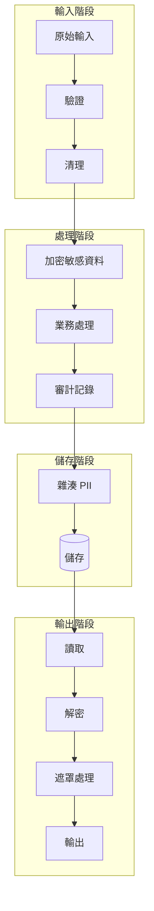

### 資料存取控制

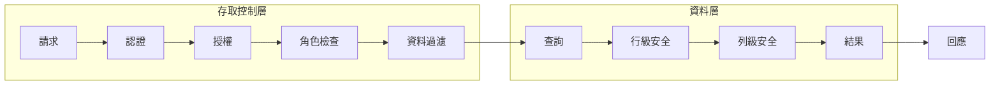

## 效能優化策略

### 查詢優化流程

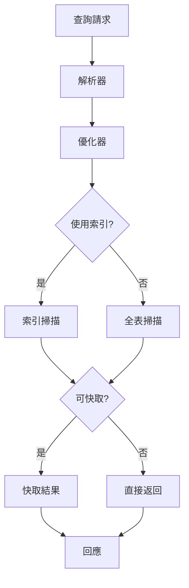

### 批次處理流程

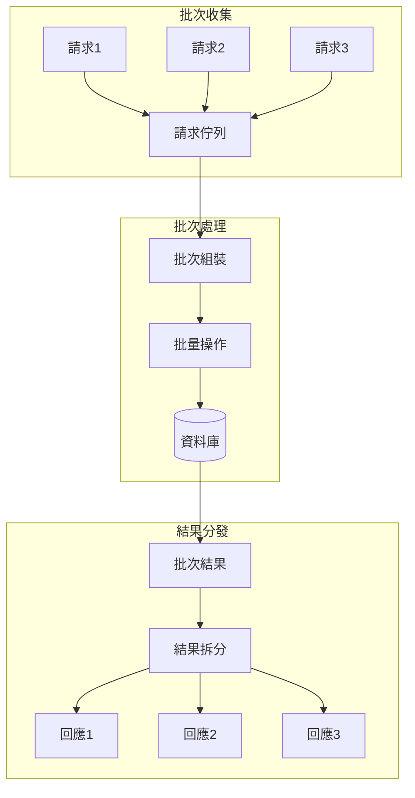

---

最後更新：2025-08-20
