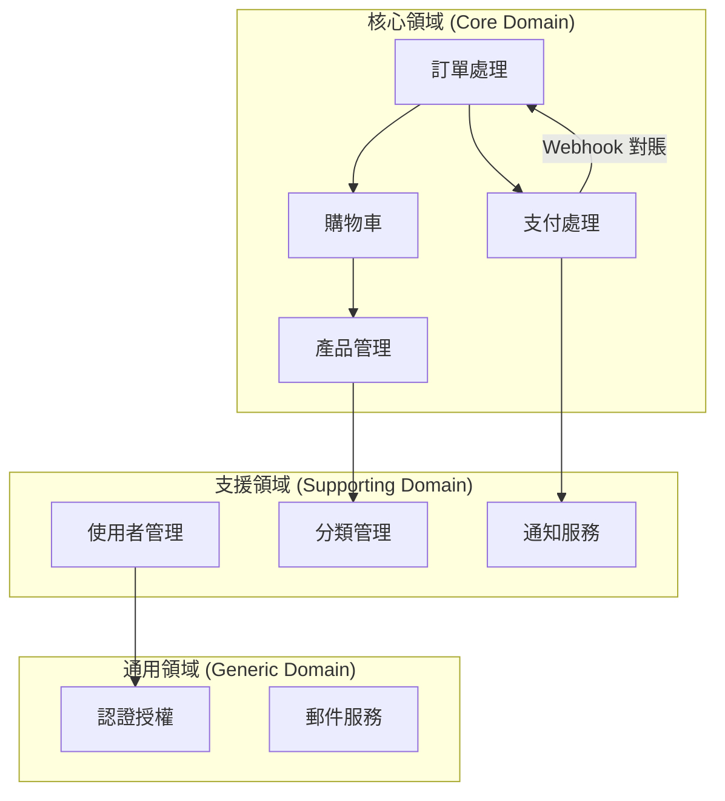
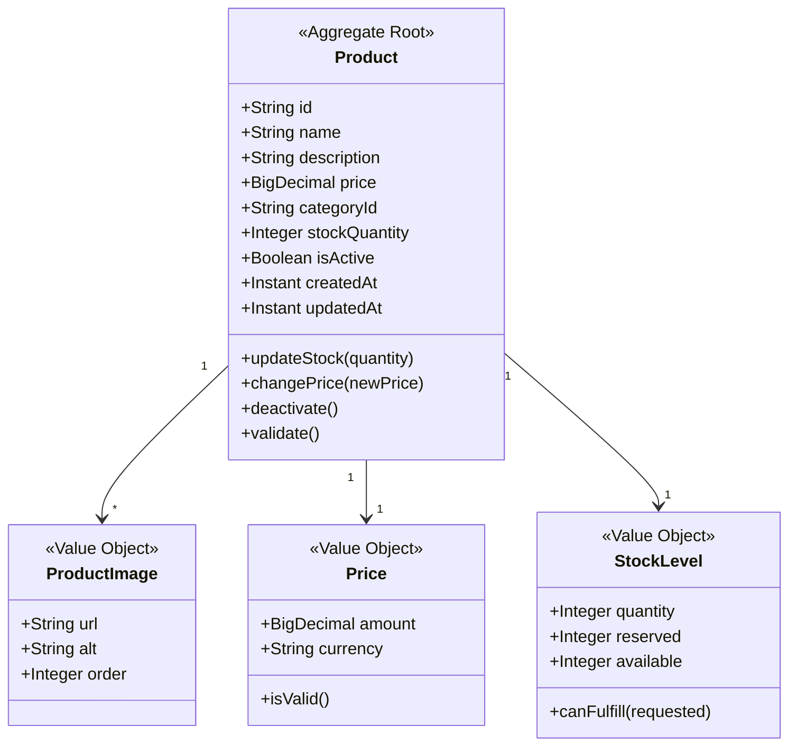
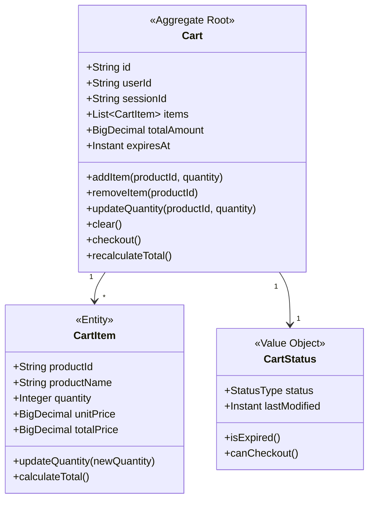
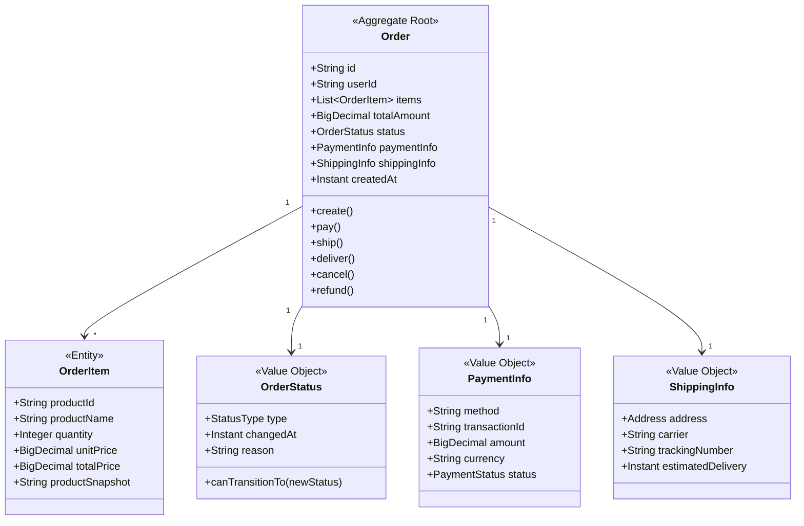
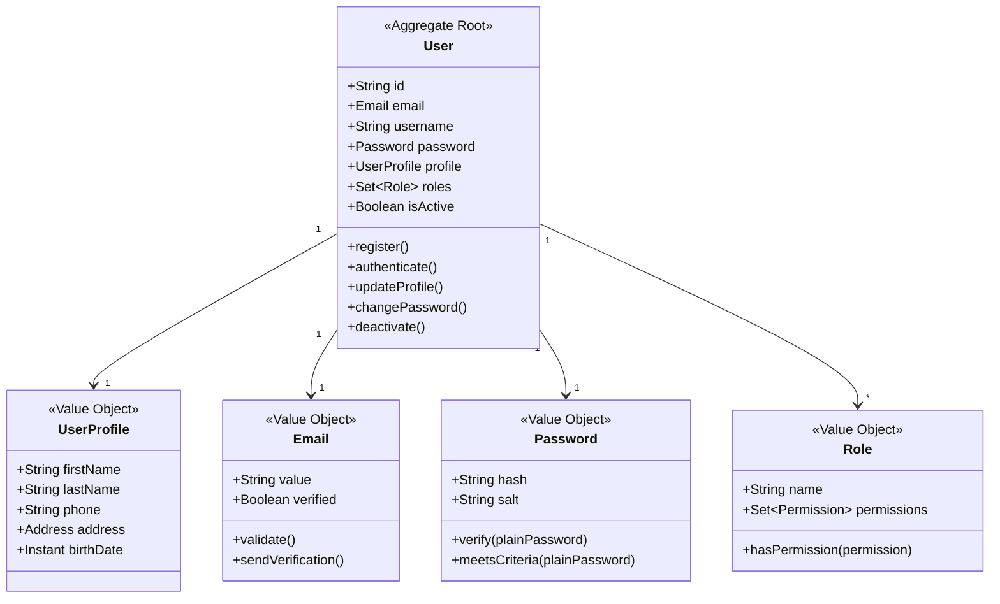
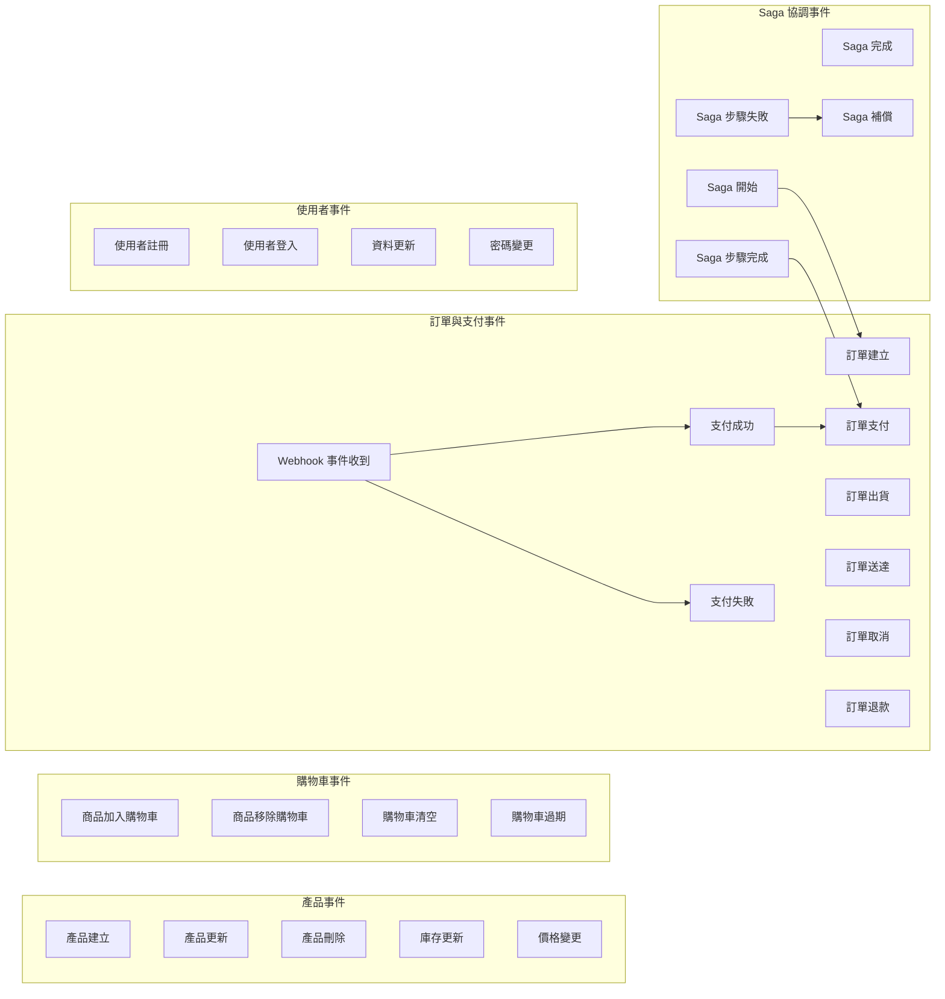
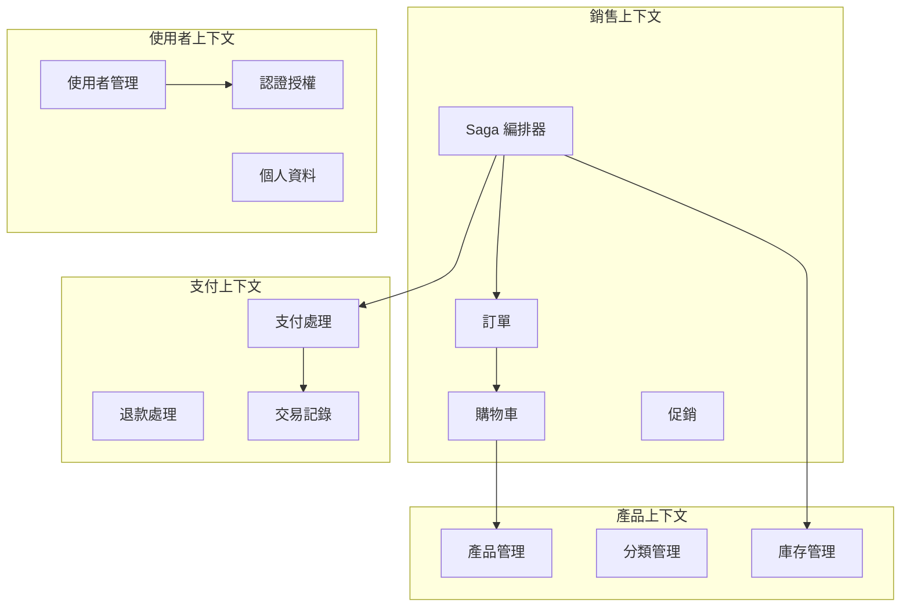
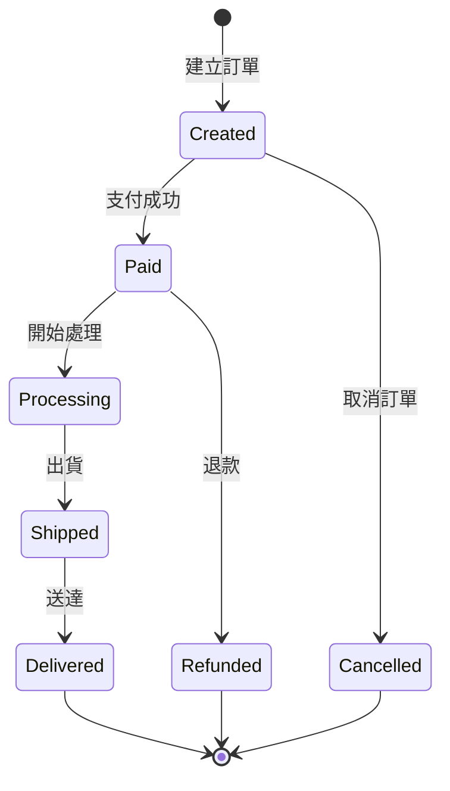

# DDD 領域模型設計

本文件描述 Fake Store API 的領域驅動設計（Domain-Driven Design）模型。

## 領域概覽



## 聚合根（Aggregate Roots）

### 1. Product 聚合



### 2. Cart 聚合



### 3. Order 聚合



### 4. User 聚合



## 領域事件（Domain Events）



## 領域服務（Domain Services）

### 1. 庫存服務
```java
public interface InventoryService {
    boolean checkAvailability(String productId, int quantity);
    void reserveStock(String productId, int quantity);
    void releaseStock(String productId, int quantity);
    void updateStock(String productId, int adjustment);
}
```

### 2. 定價服務
```java
public interface PricingService {
    BigDecimal calculatePrice(Product product, int quantity);
    BigDecimal applyDiscount(BigDecimal price, Discount discount);
    BigDecimal calculateTax(BigDecimal price, Address address);
    BigDecimal calculateShipping(List<OrderItem> items, Address address);
}
```

### 3. 支付服務
```java
public interface PaymentService {
    PaymentResult processPayment(Order order, PaymentMethod method);
    RefundResult processRefund(Order order, BigDecimal amount);
    PaymentStatus checkPaymentStatus(String transactionId);
}
```

### 4. Saga 編排服務
```java
public interface SagaOrchestrationService {
    CompletableFuture<SagaResult> processOrderSaga(OrderCreationRequest request);
    void compensateOrderSaga(String sagaId, SagaStep failedStep);
    SagaState getSagaState(String sagaId);
}
```

## 倉儲介面（Repository Interfaces）

### 1. 產品倉儲
```java
public interface ProductRepository {
    // 基本 CRUD
    Product findById(String id);
    List<Product> findAll(Pageable pageable);
    Product save(Product product);
    void delete(String id);
    
    // 領域特定查詢
    List<Product> findByCategory(String categoryId);
    List<Product> findByPriceRange(BigDecimal min, BigDecimal max);
    List<Product> searchByName(String keyword);
    boolean existsBySku(String sku);
}
```

### 2. 訂單倉儲
```java
public interface OrderRepository {
    Order findById(String id);
    List<Order> findByUserId(String userId);
    List<Order> findByStatus(OrderStatus status);
    Order save(Order order);
    
    // 統計查詢
    BigDecimal getTotalSalesByDateRange(LocalDate start, LocalDate end);
    List<Order> findPendingOrders();
}
```

## 限界上下文（Bounded Contexts）



## 防腐層（Anti-Corruption Layer）

### 外部服務整合
```java
// Stripe 支付整合防腐層
public class StripePaymentAdapter implements PaymentService {
    private final StripeClient stripeClient;
    
    @Override
    public PaymentResult processPayment(Order order, PaymentMethod method) {
        // 將領域模型轉換為 Stripe API 格式
        StripePaymentRequest request = convertToStripeFormat(order, method);
        StripeResponse response = stripeClient.createPayment(request);
        // 將 Stripe 回應轉換回領域模型
        return convertToDomainModel(response);
    }
}

// OAuth 認證整合防腐層
public class OAuthAdapter implements AuthenticationService {
    private final GoogleOAuthClient googleClient;
    private final GitHubOAuthClient githubClient;
    
    public AuthResult authenticate(OAuthProvider provider, String code) {
        // 統一不同 OAuth 提供者的介面
        switch (provider) {
            case GOOGLE:
                return adaptGoogleAuth(googleClient.authenticate(code));
            case GITHUB:
                return adaptGitHubAuth(githubClient.authenticate(code));
            default:
                throw new UnsupportedProviderException(provider);
        }
    }
}
```

## 領域規則與不變量（Invariants）

### 業務規則
1. **產品庫存規則**：庫存數量不能為負數
2. **購物車規則**：購物車商品總數不能超過 100 件
3. **訂單規則**：訂單總金額必須大於 0
4. **價格規則**：產品價格必須大於 0
5. **使用者規則**：Email 必須唯一

### 狀態轉換規則


---

最後更新：2025-08-20
