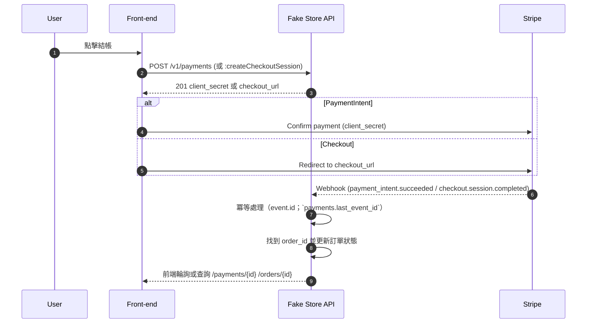

# 支付流程案例（PaymentIntent 與 Checkout）

本文件示範兩種支付流程：
- PaymentIntent：自建前端流程（回 `client_secret`）。
- Checkout：Stripe 託管頁（回 `checkout_url`）。

## PaymentIntent 流程

1) 建立支付
```bash
curl -X POST \
  -H "Authorization: Bearer <jwt-or-api-key>" \
  -H "Content-Type: application/json" \
  -d '{
        "source_type":"cart",
        "payment_method":"stripe",
        "return_url":"https://example.com/payment/return"
      }' \
  https://api.fakestore.happyhacking.ninja/v1/payments
```

成功回應（節錄）：
```json
{
  "payment_id":"pay_abc123",
  "payment_intent":{
    "id":"pi_3MqrF82eZvKYlo2C0KhoLsWy",
    "status":"requires_confirmation",
    "client_secret":"pi_..._secret_..."
  },
  "status":"pending"
}
```

2) 前端用 `client_secret` 調用 Stripe.js 進行確認；等待 Webhook 更新訂單狀態。

## Checkout 流程

1) 建立 Checkout Session
```bash
curl -X POST \
  -H "Authorization: Bearer <jwt-or-api-key>" \
  -H "Content-Type: application/json" \
  -d '{
        "source_type":"cart",
        "success_url":"https://example.com/success",
        "cancel_url":"https://example.com/cancel"
      }' \
  https://api.fakestore.happyhacking.ninja/v1/payments:createCheckoutSession
```

成功回應（節錄）：
```json
{
  "checkout_url":"https://checkout.stripe.com/c/pay/cs_test_123...",
  "session_id":"cs_test_123",
  "order_id":"order_abc123"
}
```

2) 前端重導到 `checkout_url` 完成支付；等待 Webhook 更新訂單狀態。

## Webhook 對賬
- PaymentIntent：監聽 `payment_intent.succeeded` / `payment_intent.payment_failed`。
- Checkout：監聽 `checkout.session.completed`；建議在 Session metadata 帶 `order_id` 以便快速對應。

### 對賬時序圖（概念）



### Webhook 事件示例（簡化）

```json
{
  "id": "evt_1A2B3C",
  "type": "payment_intent.succeeded",
  "data": {
    "object": {
      "id": "pi_3MqrF8...",
      "object": "payment_intent",
      "amount": 2999,
      "currency": "usd",
      "metadata": { "order_id": "order_abc123" }
    }
  }
}
```

伺服器處理：以 `evt_...` 作冪等鍵，查 `payments.last_event_id`，若未處理：更新 `payments.status='succeeded'`、`paid_at`、`last_event_id`，並同步更新對應訂單為 `paid`。
