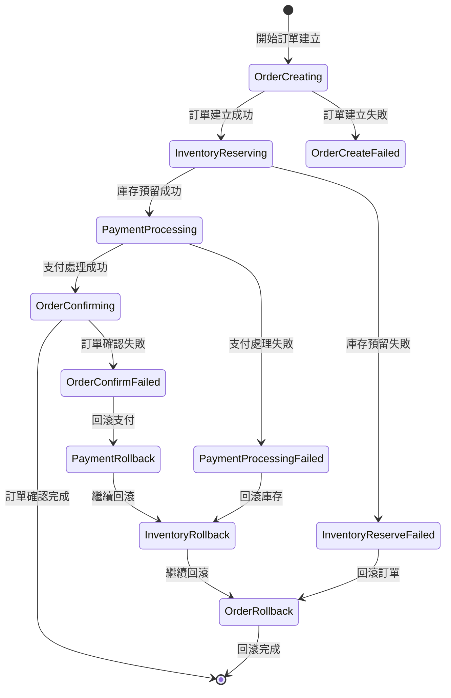

# Saga 編排模式實作範例

[← 返回文件中心](../README.md) | [實作範例](../examples/) | **Saga 編排實作**

## 文件資訊

- **版本**: 1.0.0
- **最後更新**: 2025-08-23
- **目標讀者**: 後端開發者、架構師
- **相關文件**: 
  - [測試策略](../implementation/testing-strategy.md)
  - [架構改進建議](../../ARCHITECTURE_IMPROVEMENTS.md)
  - [購物車實作](./cart-implementation.md)

## 概述

本文件展示如何使用 Saga 編排模式處理訂單建立的分散式事務，確保跨多個服務的資料一致性。

## 1. Saga 狀態機設計

### 訂單處理 Saga 流程



## 2. Saga 編排器實作

### OrderSagaOrchestrator

```java
package com.fakestore.saga.orchestrator;

import com.fakestore.saga.command.*;
import com.fakestore.saga.event.*;
import com.fakestore.saga.state.SagaState;
import com.fakestore.saga.state.SagaStateRepository;
import com.fakestore.service.OrderService;
import com.fakestore.service.InventoryService;
import com.fakestore.service.PaymentService;
import lombok.RequiredArgsConstructor;
import lombok.extern.slf4j.Slf4j;
import org.springframework.stereotype.Component;
import org.springframework.transaction.annotation.Transactional;
import reactor.core.publisher.Mono;

import java.time.Instant;
import java.util.UUID;
import java.util.concurrent.CompletableFuture;

@Slf4j
@Component
@RequiredArgsConstructor
public class OrderSagaOrchestrator {
    
    private final OrderService orderService;
    private final InventoryService inventoryService;
    private final PaymentService paymentService;
    private final SagaStateRepository sagaStateRepository;
    private final SagaEventPublisher eventPublisher;
    
    @Transactional
    public CompletableFuture<SagaResult> processOrder(OrderCreationRequest request) {
        String sagaId = UUID.randomUUID().toString();
        
        log.info("開始訂單 Saga 流程 - sagaId: {}, userId: {}", 
            sagaId, request.getUserId());
        
        // 建立 Saga 狀態
        SagaState sagaState = SagaState.builder()
            .sagaId(sagaId)
            .sagaType("ORDER_CREATION")
            .currentStep("ORDER_CREATING")
            .status("IN_PROGRESS")
            .payload(request)
            .createdAt(Instant.now())
            .build();
            
        return sagaStateRepository.save(sagaState)
            .then(executeOrderCreation(sagaId, request))
            .toFuture();
    }
    
    private Mono<SagaResult> executeOrderCreation(String sagaId, OrderCreationRequest request) {
        return orderService.createOrder(request)
            .flatMap(orderId -> {
                log.info("訂單建立成功 - sagaId: {}, orderId: {}", sagaId, orderId);
                return updateSagaState(sagaId, "INVENTORY_RESERVING", null)
                    .then(executeInventoryReservation(sagaId, orderId, request));
            })
            .onErrorResume(error -> {
                log.error("訂單建立失敗 - sagaId: {}, error: {}", sagaId, error.getMessage());
                return handleOrderCreationFailure(sagaId, error);
            });
    }
    
    private Mono<SagaResult> executeInventoryReservation(String sagaId, String orderId, OrderCreationRequest request) {
        return inventoryService.reserveInventory(orderId, request.getItems())
            .flatMap(reservationId -> {
                log.info("庫存預留成功 - sagaId: {}, reservationId: {}", sagaId, reservationId);
                return updateSagaState(sagaId, "PAYMENT_PROCESSING", Map.of("reservationId", reservationId))
                    .then(executePaymentProcessing(sagaId, orderId, request, reservationId));
            })
            .onErrorResume(error -> {
                log.error("庫存預留失敗 - sagaId: {}, error: {}", sagaId, error.getMessage());
                return handleInventoryReservationFailure(sagaId, orderId, error);
            });
    }
    
    private Mono<SagaResult> executePaymentProcessing(String sagaId, String orderId, 
            OrderCreationRequest request, String reservationId) {
        
        PaymentRequest paymentRequest = PaymentRequest.builder()
            .orderId(orderId)
            .amount(request.getTotalAmount())
            .paymentMethod(request.getPaymentMethod())
            .build();
            
        return paymentService.processPayment(paymentRequest)
            .flatMap(paymentResult -> {
                log.info("支付處理成功 - sagaId: {}, paymentId: {}", sagaId, paymentResult.getPaymentId());
                return updateSagaState(sagaId, "ORDER_CONFIRMING", 
                        Map.of("paymentId", paymentResult.getPaymentId()))
                    .then(executeOrderConfirmation(sagaId, orderId));
            })
            .onErrorResume(error -> {
                log.error("支付處理失敗 - sagaId: {}, error: {}", sagaId, error.getMessage());
                return handlePaymentProcessingFailure(sagaId, orderId, reservationId, error);
            });
    }
    
    private Mono<SagaResult> executeOrderConfirmation(String sagaId, String orderId) {
        return orderService.confirmOrder(orderId)
            .flatMap(confirmed -> {
                log.info("訂單確認成功 - sagaId: {}, orderId: {}", sagaId, orderId);
                return updateSagaState(sagaId, "COMPLETED", null)
                    .then(Mono.just(SagaResult.success(sagaId, orderId)));
            })
            .onErrorResume(error -> {
                log.error("訂單確認失敗 - sagaId: {}, error: {}", sagaId, error.getMessage());
                return handleOrderConfirmationFailure(sagaId, orderId, error);
            });
    }
    
    // 補償操作方法
    private Mono<SagaResult> handleOrderCreationFailure(String sagaId, Throwable error) {
        return updateSagaState(sagaId, "ORDER_CREATE_FAILED", Map.of("error", error.getMessage()))
            .then(Mono.just(SagaResult.failure(sagaId, "訂單建立失敗: " + error.getMessage())));
    }
    
    private Mono<SagaResult> handleInventoryReservationFailure(String sagaId, String orderId, Throwable error) {
        return updateSagaState(sagaId, "INVENTORY_RESERVE_FAILED", Map.of("error", error.getMessage()))
            .then(compensateOrderCreation(sagaId, orderId))
            .then(Mono.just(SagaResult.failure(sagaId, "庫存預留失敗: " + error.getMessage())));
    }
    
    private Mono<SagaResult> handlePaymentProcessingFailure(String sagaId, String orderId, 
            String reservationId, Throwable error) {
        
        return updateSagaState(sagaId, "PAYMENT_PROCESSING_FAILED", Map.of("error", error.getMessage()))
            .then(compensateInventoryReservation(sagaId, reservationId))
            .then(compensateOrderCreation(sagaId, orderId))
            .then(Mono.just(SagaResult.failure(sagaId, "支付處理失敗: " + error.getMessage())));
    }
    
    // 補償操作實作
    private Mono<Void> compensateOrderCreation(String sagaId, String orderId) {
        log.info("執行訂單建立補償 - sagaId: {}, orderId: {}", sagaId, orderId);
        return orderService.cancelOrder(orderId)
            .doOnSuccess(v -> log.info("訂單建立補償完成 - sagaId: {}", sagaId))
            .doOnError(error -> log.error("訂單建立補償失敗 - sagaId: {}, error: {}", 
                sagaId, error.getMessage()));
    }
    
    private Mono<Void> compensateInventoryReservation(String sagaId, String reservationId) {
        log.info("執行庫存預留補償 - sagaId: {}, reservationId: {}", sagaId, reservationId);
        return inventoryService.releaseInventory(reservationId)
            .doOnSuccess(v -> log.info("庫存預留補償完成 - sagaId: {}", sagaId))
            .doOnError(error -> log.error("庫存預留補償失敗 - sagaId: {}, error: {}", 
                sagaId, error.getMessage()));
    }
    
    // 輔助方法
    private Mono<Void> updateSagaState(String sagaId, String step, Map<String, Object> stepData) {
        return getSagaState(sagaId)
            .flatMap(sagaState -> {
                sagaState.setCurrentStep(step);
                sagaState.setUpdatedAt(Instant.now());
                if (stepData != null) {
                    sagaState.getStepData().putAll(stepData);
                }
                return sagaStateRepository.save(sagaState);
            })
            .then();
    }
    
    private Mono<SagaState> getSagaState(String sagaId) {
        return sagaStateRepository.findById(sagaId)
            .switchIfEmpty(Mono.error(new SagaNotFoundException(sagaId)));
    }
}
```

## 3. 測試範例

### Saga 編排器測試

```java
package com.fakestore.saga.orchestrator;

import com.fakestore.saga.state.SagaState;
import com.fakestore.saga.state.SagaStateRepository;
import com.fakestore.service.OrderService;
import com.fakestore.service.InventoryService;
import com.fakestore.service.PaymentService;
import org.junit.jupiter.api.Test;
import org.junit.jupiter.api.extension.ExtendWith;
import org.mockito.InjectMocks;
import org.mockito.Mock;
import org.mockito.junit.jupiter.MockitoExtension;
import reactor.core.publisher.Mono;
import reactor.test.StepVerifier;

import java.math.BigDecimal;
import java.util.concurrent.CompletableFuture;

import static org.mockito.ArgumentMatchers.any;
import static org.mockito.ArgumentMatchers.eq;
import static org.mockito.Mockito.*;

@ExtendWith(MockitoExtension.class)
class OrderSagaOrchestratorTest {
    
    @Mock
    private OrderService orderService;
    
    @Mock
    private InventoryService inventoryService;
    
    @Mock
    private PaymentService paymentService;
    
    @Mock
    private SagaStateRepository sagaStateRepository;
    
    @InjectMocks
    private OrderSagaOrchestrator orchestrator;
    
    @Test
    void shouldCompleteOrderSagaSuccessfully() {
        // Given
        OrderCreationRequest request = createOrderRequest();
        SagaState sagaState = createSagaState();
        
        when(sagaStateRepository.save(any(SagaState.class))).thenReturn(Mono.just(sagaState));
        when(orderService.createOrder(any())).thenReturn(Mono.just("order-123"));
        when(inventoryService.reserveInventory(eq("order-123"), any())).thenReturn(Mono.just("reservation-456"));
        when(paymentService.processPayment(any())).thenReturn(Mono.just(createPaymentResult()));
        when(orderService.confirmOrder("order-123")).thenReturn(Mono.just(true));
        
        // When
        CompletableFuture<SagaResult> result = orchestrator.processOrder(request);
        
        // Then
        StepVerifier.create(Mono.fromFuture(result))
            .expectNextMatches(sagaResult -> 
                sagaResult.isSuccess() && 
                "order-123".equals(sagaResult.getOrderId())
            )
            .verifyComplete();
            
        verify(orderService).createOrder(request);
        verify(inventoryService).reserveInventory(eq("order-123"), any());
        verify(paymentService).processPayment(any());
        verify(orderService).confirmOrder("order-123");
    }
    
    @Test
    void shouldCompensateOnPaymentFailure() {
        // Given
        OrderCreationRequest request = createOrderRequest();
        SagaState sagaState = createSagaState();
        
        when(sagaStateRepository.save(any(SagaState.class))).thenReturn(Mono.just(sagaState));
        when(sagaStateRepository.findById(any())).thenReturn(Mono.just(sagaState));
        when(orderService.createOrder(any())).thenReturn(Mono.just("order-123"));
        when(inventoryService.reserveInventory(eq("order-123"), any())).thenReturn(Mono.just("reservation-456"));
        when(paymentService.processPayment(any()))
            .thenReturn(Mono.error(new PaymentException("Payment failed")));
        when(inventoryService.releaseInventory("reservation-456")).thenReturn(Mono.empty());
        when(orderService.cancelOrder("order-123")).thenReturn(Mono.empty());
        
        // When
        CompletableFuture<SagaResult> result = orchestrator.processOrder(request);
        
        // Then
        StepVerifier.create(Mono.fromFuture(result))
            .expectNextMatches(sagaResult -> 
                sagaResult.isFailed() && 
                sagaResult.getFailureReason().contains("支付處理失敗")
            )
            .verifyComplete();
            
        verify(inventoryService).releaseInventory("reservation-456");
        verify(orderService).cancelOrder("order-123");
    }
    
    private OrderCreationRequest createOrderRequest() {
        return OrderCreationRequest.builder()
            .userId("user-123")
            .items(List.of())
            .totalAmount(BigDecimal.valueOf(100.00))
            .paymentMethod("credit_card")
            .build();
    }
    
    private SagaState createSagaState() {
        return SagaState.builder()
            .sagaId("saga-123")
            .sagaType("ORDER_CREATION")
            .currentStep("ORDER_CREATING")
            .status("IN_PROGRESS")
            .build();
    }
    
    private PaymentResult createPaymentResult() {
        return PaymentResult.builder()
            .paymentId("payment-789")
            .status("completed")
            .build();
    }
}
```

## 相關文件

- [測試策略](../implementation/testing-strategy.md) - ArchUnit 架構測試
- [架構改進建議](../../ARCHITECTURE_IMPROVEMENTS.md) - Saga 技術決策
- [購物車實作](./cart-implementation.md) - 購物車功能實作
- [產品 API 實作](./product-api.md) - 產品管理功能

---

*本文件是 Fake Store API 專案的一部分*

*最後更新: 2025-08-23*