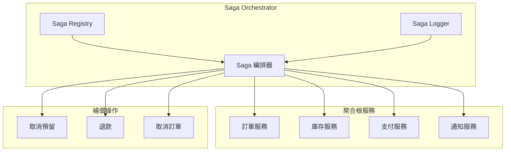
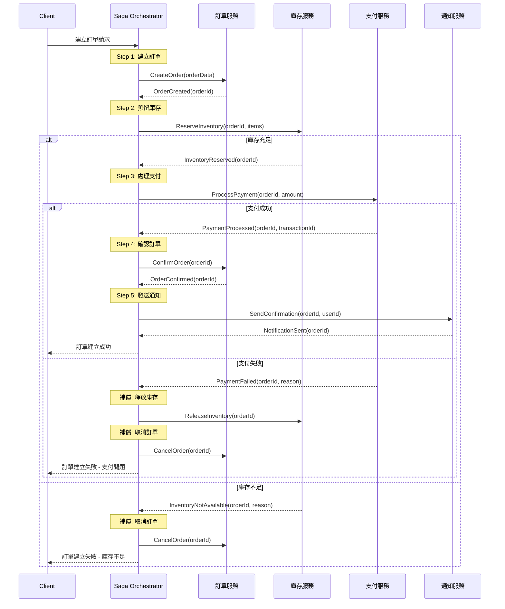

# Saga 編排模式實作

本文件說明 Fake Store API 中 Saga 模式的實作設計，用於處理分散式事務與資料一致性。

## 架構設計

### Saga 協調器架構



### 訂單處理 Saga 流程



## 實作範例

### Saga 編排器核心類別

```java
@Component
@Slf4j
public class OrderSagaOrchestrator {
    
    private final OrderService orderService;
    private final InventoryService inventoryService;
    private final PaymentService paymentService;
    private final NotificationService notificationService;
    private final SagaStateRepository sagaStateRepository;
    
    public CompletableFuture<SagaResult> processOrder(OrderCreationRequest request) {
        String sagaId = generateSagaId();
        SagaState sagaState = initializeSagaState(sagaId, request);
        
        return executeStep1_CreateOrder(sagaState)
            .thenCompose(this::executeStep2_ReserveInventory)
            .thenCompose(this::executeStep3_ProcessPayment)
            .thenCompose(this::executeStep4_ConfirmOrder)
            .thenCompose(this::executeStep5_SendNotification)
            .exceptionally(throwable -> handleFailure(sagaState, throwable));
    }
    
    private CompletableFuture<SagaState> executeStep1_CreateOrder(SagaState sagaState) {
        return orderService.createOrder(sagaState.getOrderData())
            .thenApply(orderId -> {
                sagaState.setOrderId(orderId);
                sagaState.markStepCompleted(SagaStep.CREATE_ORDER);
                sagaStateRepository.save(sagaState);
                return sagaState;
            })
            .exceptionally(throwable -> {
                log.error("Step 1 failed: {}", throwable.getMessage());
                throw new SagaExecutionException("CREATE_ORDER", throwable);
            });
    }
    
    private CompletableFuture<SagaState> executeStep2_ReserveInventory(SagaState sagaState) {
        return inventoryService.reserveInventory(sagaState.getOrderId(), sagaState.getItems())
            .thenApply(reservationId -> {
                sagaState.setInventoryReservationId(reservationId);
                sagaState.markStepCompleted(SagaStep.RESERVE_INVENTORY);
                sagaStateRepository.save(sagaState);
                return sagaState;
            })
            .exceptionally(throwable -> {
                log.error("Step 2 failed: {}", throwable.getMessage());
                executeCompensation_CancelOrder(sagaState);
                throw new SagaExecutionException("RESERVE_INVENTORY", throwable);
            });
    }
    
    private CompletableFuture<SagaState> executeStep3_ProcessPayment(SagaState sagaState) {
        return paymentService.processPayment(sagaState.getOrderId(), sagaState.getTotalAmount())
            .thenApply(paymentResult -> {
                sagaState.setTransactionId(paymentResult.getTransactionId());
                sagaState.markStepCompleted(SagaStep.PROCESS_PAYMENT);
                sagaStateRepository.save(sagaState);
                return sagaState;
            })
            .exceptionally(throwable -> {
                log.error("Step 3 failed: {}", throwable.getMessage());
                executeCompensation_ReleaseInventory(sagaState);
                executeCompensation_CancelOrder(sagaState);
                throw new SagaExecutionException("PROCESS_PAYMENT", throwable);
            });
    }
    
    // 補償操作
    private void executeCompensation_ReleaseInventory(SagaState sagaState) {
        if (sagaState.isStepCompleted(SagaStep.RESERVE_INVENTORY)) {
            inventoryService.releaseInventory(sagaState.getInventoryReservationId())
                .thenRun(() -> {
                    sagaState.markCompensationCompleted(SagaStep.RESERVE_INVENTORY);
                    sagaStateRepository.save(sagaState);
                });
        }
    }
    
    private void executeCompensation_CancelOrder(SagaState sagaState) {
        if (sagaState.isStepCompleted(SagaStep.CREATE_ORDER)) {
            orderService.cancelOrder(sagaState.getOrderId())
                .thenRun(() -> {
                    sagaState.markCompensationCompleted(SagaStep.CREATE_ORDER);
                    sagaStateRepository.save(sagaState);
                });
        }
    }
}
```

### Saga 狀態管理

```java
@Entity
@Table(name = "saga_states")
@Data
public class SagaState {
    
    @Id
    private String sagaId;
    
    @Enumerated(EnumType.STRING)
    private SagaStatus status;
    
    private String orderId;
    private String inventoryReservationId;
    private String transactionId;
    
    @ElementCollection
    @Enumerated(EnumType.STRING)
    private Set<SagaStep> completedSteps = new HashSet<>();
    
    @ElementCollection
    @Enumerated(EnumType.STRING)
    private Set<SagaStep> compensatedSteps = new HashSet<>();
    
    @Column(columnDefinition = "TEXT")
    private String orderDataJson;
    
    @CreationTimestamp
    private Instant createdAt;
    
    @UpdateTimestamp
    private Instant updatedAt;
    
    // 業務邏輯方法
    public boolean isStepCompleted(SagaStep step) {
        return completedSteps.contains(step);
    }
    
    public void markStepCompleted(SagaStep step) {
        completedSteps.add(step);
        updateStatus();
    }
    
    public void markCompensationCompleted(SagaStep step) {
        compensatedSteps.add(step);
        updateStatus();
    }
    
    private void updateStatus() {
        if (completedSteps.containsAll(Arrays.asList(SagaStep.values()))) {
            status = SagaStatus.COMPLETED;
        } else if (!compensatedSteps.isEmpty()) {
            status = SagaStatus.COMPENSATED;
        } else {
            status = SagaStatus.RUNNING;
        }
    }
}

enum SagaStatus {
    CREATED, RUNNING, COMPLETED, COMPENSATED, FAILED
}

enum SagaStep {
    CREATE_ORDER, RESERVE_INVENTORY, PROCESS_PAYMENT, CONFIRM_ORDER, SEND_NOTIFICATION
}
```

## 冪等與去重（Idempotency & De-duplication）

為避免重試/重入造成副作用，建議：
- 以 `sagaId + step` 作為冪等鍵；寫入步驟前先檢查是否已完成。
- 補償操作亦記錄 `compensatedSteps`，避免重複補償。
- 外部呼叫（庫存/支付）加上 `Idempotency-Key: <sagaId:step>` 標頭（若對方支援）。

```java
boolean tryMarkStep(SagaState s, SagaStep step) {
  if (s.getCompletedSteps().contains(step)) return false; // 已處理
  s.markStepCompleted(step);
  sagaStateRepository.save(s);
  return true;
}
```

## 狀態持久化與欄位建議
- `status`：RUNNING | COMPLETED | COMPENSATED | FAILED
- `completedSteps`, `compensatedSteps`：Set<SagaStep>
- `lastError`：最後一次錯誤訊息/原因碼
- `retryCount`, `nextRetryAt`：重試次數與下次重試時間
- `createdAt`, `updatedAt`：審計欄位

這些欄位可支持觀測、重試與人工診斷。

## 重試與退避策略
- 對暫時性錯誤（網路/Rate Limit）採固定或指數退避（Exponential Backoff + Jitter）。
- 設定最大重試次數（例如 3~5 次）；超出則標記 `FAILED` 並通知人工或轉入死信佇列。
- 在 Spring 環境可搭配 Resilience4j/Retry 或自訂 Scheduler。

## 與 Webhook 對賬整合
- 若支付結果以 Webhook 為最終裁定，Saga 的支付步驟可分解為：
  1) 發起支付（建立 PaymentIntent/Checkout Session，寫入 order/payment metadata）
  2) 等待 Webhook 事件（含超時策略）→ 更新訂單為已支付；若超時未收到，可輪詢支付狀態或標為待人工處理。
- 透過 `event.id` 冪等處理 Webhook，並以 `order_id`/`payment_intent_id` 對應到 Saga。
  詳見《監控與對賬》（docs/operations/monitoring.md）。

## 觀測與日誌（Observability）
- 於 logs/traces 中加入 `sagaId`、`orderId`、`payment_intent_id/session_id` 等欄位，方便關聯查詢。
- 指標：每步驟成功率/延遲、補償次數、重試次數、最終成功率。

### 錯誤處理與重試機制

```java
@Component
public class SagaErrorHandler {
    
    private final SagaStateRepository sagaStateRepository;
    
    @Retryable(value = {SagaExecutionException.class}, maxAttempts = 3, 
               backoff = @Backoff(delay = 1000, multiplier = 2))
    public CompletableFuture<SagaResult> handleRetriableError(SagaState sagaState, 
                                                              SagaExecutionException exception) {
        log.warn("Saga {} failed at step {}, retrying...", 
                 sagaState.getSagaId(), exception.getFailedStep());
        
        // 基於失敗的步驟執行重試邏輯
        return retryFromStep(sagaState, exception.getFailedStep());
    }
    
    @Recover
    public SagaResult handleNonRetriableError(SagaExecutionException exception, 
                                              SagaState sagaState) {
        log.error("Saga {} permanently failed at step {}", 
                  sagaState.getSagaId(), exception.getFailedStep());
        
        sagaState.setStatus(SagaStatus.FAILED);
        sagaStateRepository.save(sagaState);
        
        // 執行完整補償流程
        executeFullCompensation(sagaState);
        
        return SagaResult.failed(exception.getMessage());
    }
}
```

## 測試策略

### 單元測試

```java
@ExtendWith(MockitoExtension.class)
class OrderSagaOrchestratorTest {
    
    @Mock private OrderService orderService;
    @Mock private InventoryService inventoryService;
    @Mock private PaymentService paymentService;
    @Mock private SagaStateRepository sagaStateRepository;
    
    @InjectMocks
    private OrderSagaOrchestrator orchestrator;
    
    @Test
    void shouldCompleteOrderSagaSuccessfully() {
        // Given
        OrderCreationRequest request = createOrderRequest();
        when(orderService.createOrder(any())).thenReturn(CompletableFuture.completedFuture("order-123"));
        when(inventoryService.reserveInventory(any(), any())).thenReturn(CompletableFuture.completedFuture("res-456"));
        when(paymentService.processPayment(any(), any())).thenReturn(CompletableFuture.completedFuture(paymentResult()));
        
        // When
        CompletableFuture<SagaResult> result = orchestrator.processOrder(request);
        
        // Then
        assertThat(result.join().isSuccess()).isTrue();
        verify(orderService).createOrder(any());
        verify(inventoryService).reserveInventory(eq("order-123"), any());
        verify(paymentService).processPayment(eq("order-123"), any());
    }
    
    @Test
    void shouldCompensateOnPaymentFailure() {
        // Given
        when(orderService.createOrder(any())).thenReturn(CompletableFuture.completedFuture("order-123"));
        when(inventoryService.reserveInventory(any(), any())).thenReturn(CompletableFuture.completedFuture("res-456"));
        when(paymentService.processPayment(any(), any()))
            .thenReturn(CompletableFuture.failedFuture(new PaymentException("Payment failed")));
        
        // When
        CompletableFuture<SagaResult> result = orchestrator.processOrder(createOrderRequest());
        
        // Then
        assertThat(result.join().isFailed()).isTrue();
        verify(inventoryService).releaseInventory("res-456");
        verify(orderService).cancelOrder("order-123");
    }
}
```

### 整合測試

```java
@SpringBootTest
@Testcontainers
class OrderSagaIntegrationTest {
    
    @Container
    static PostgreSQLContainer<?> postgres = new PostgreSQLContainer<>("postgres:15")
            .withDatabaseName("saga_test")
            .withUsername("test")
            .withPassword("test");
    
    @Autowired
    private OrderSagaOrchestrator orchestrator;
    
    @Autowired
    private TestRestTemplate restTemplate;
    
    @Test
    void shouldHandleCompleteOrderFlow() {
        // Given: 設置測試資料
        setupTestData();
        
        // When: 執行完整 Saga 流程
        OrderCreationRequest request = createValidOrderRequest();
        SagaResult result = orchestrator.processOrder(request).join();
        
        // Then: 驗證結果與狀態
        assertThat(result.isSuccess()).isTrue();
        
        // 驗證訂單狀態
        String orderId = result.getOrderId();
        assertThat(getOrderStatus(orderId)).isEqualTo(OrderStatus.CONFIRMED);
        
        // 驗證庫存扣減
        assertThat(getProductStock("product-1")).isEqualTo(8); // 原10-2=8
        
        // 驗證支付記錄
        assertThat(getPaymentStatus(orderId)).isEqualTo(PaymentStatus.COMPLETED);
    }
    
    @Test
    void shouldRollbackOnInventoryShortage() {
        // Given: 庫存不足的情況
        setProductStock("product-1", 1);
        
        // When
        OrderCreationRequest request = createOrderRequestForQuantity(5);
        SagaResult result = orchestrator.processOrder(request).join();
        
        // Then
        assertThat(result.isFailed()).isTrue();
        assertThat(result.getFailureReason()).contains("庫存不足");
        
        // 驗證沒有訂單被建立
        assertThat(countOrdersForUser("user-123")).isEqualTo(0);
    }
}
```

## 監控與可觀測性

### Saga 執行監控

```java
@Component
public class SagaMetrics {
    
    private final MeterRegistry meterRegistry;
    private final Timer sagaExecutionTimer;
    private final Counter sagaSuccessCounter;
    private final Counter sagaFailureCounter;
    
    public SagaMetrics(MeterRegistry meterRegistry) {
        this.meterRegistry = meterRegistry;
        this.sagaExecutionTimer = Timer.builder("saga.execution.time")
            .description("Saga execution time")
            .register(meterRegistry);
        this.sagaSuccessCounter = Counter.builder("saga.success")
            .description("Successful saga executions")
            .register(meterRegistry);
        this.sagaFailureCounter = Counter.builder("saga.failure")
            .description("Failed saga executions")
            .register(meterRegistry);
    }
    
    public void recordSagaExecution(String sagaType, Duration executionTime, boolean success) {
        sagaExecutionTimer.record(executionTime);
        if (success) {
            sagaSuccessCounter.increment(Tags.of("type", sagaType));
        } else {
            sagaFailureCounter.increment(Tags.of("type", sagaType));
        }
    }
}
```

### 日誌與追蹤

```java
@Slf4j
@Component
public class SagaLogger {
    
    public void logSagaStart(String sagaId, String sagaType, String correlationId) {
        MDC.put("sagaId", sagaId);
        MDC.put("correlationId", correlationId);
        log.info("Saga started - Type: {}, ID: {}", sagaType, sagaId);
    }
    
    public void logStepExecution(String step, String status, Map<String, Object> context) {
        log.info("Saga step execution - Step: {}, Status: {}, Context: {}", 
                 step, status, context);
    }
    
    public void logSagaCompletion(String sagaId, SagaStatus finalStatus, Duration totalTime) {
        log.info("Saga completed - ID: {}, Status: {}, Duration: {}ms", 
                 sagaId, finalStatus, totalTime.toMillis());
        MDC.clear();
    }
}
```

## 配置與調整

### Saga 配置參數

```yaml
# application.yml
saga:
  orchestration:
    timeout: 300s                    # 整體 Saga 超時時間
    retry:
      max-attempts: 3                # 最大重試次數
      backoff-delay: 1000ms          # 重試延遲
      backoff-multiplier: 2          # 延遲倍增係數
    compensation:
      timeout: 60s                   # 補償操作超時時間
      parallel: true                 # 並行執行補償操作
    monitoring:
      metrics-enabled: true          # 啟用指標收集
      tracing-enabled: true          # 啟用分散式追蹤
```

---

*文件版本: 1.0*  
*最後更新: 2025-08-23*
