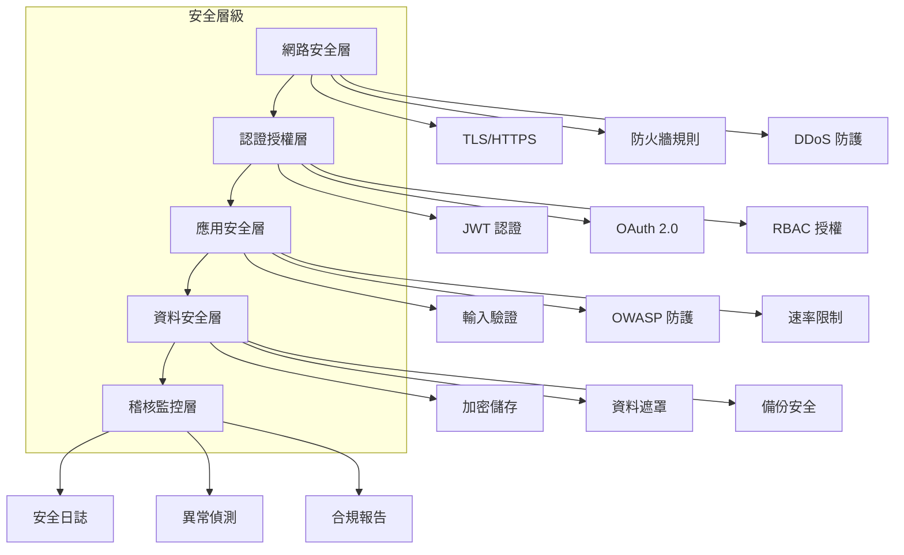

# 安全實作指南

[← 返回文件中心](../README.md) | [實作指南](../implementation/) | **安全實作**

## 文件資訊

- **版本**: 1.0.0
- **最後更新**: 2025-08-28
- **目標讀者**: 開發者、安全工程師、架構師
- **相關文件**: 
  - [認證與授權](../api/authentication.md)
  - [非功能需求](../requirements/non-functional.md)
  - [技術堆疊](./technology-stack.md)
  - [測試策略](./testing-strategy.md)

## 安全架構總覽

Fake Store API 實作多層防禦策略，涵蓋認證、授權、資料保護、網路安全和應用安全。



## 1. 認證與授權

### 1.1 JWT 認證實作

#### JWT 配置標準化
```yaml
jwt:
  # 使用 RS256 非對稱加密
  algorithm: RS256
  # Access Token 有效期 15 分鐘
  access-token-lifetime: 900
  # Refresh Token 有效期 7 天
  refresh-token-lifetime: 604800
  issuer: fake-store-api
  audience: fake-store-clients
  # RSA 金鑰對
  public-key: ${JWT_PUBLIC_KEY}
  private-key: ${JWT_PRIVATE_KEY}
```

#### JWT 服務實作
```java
@Service
public class JwtService {
    
    @Value("${jwt.private-key}")
    private String privateKey;
    
    @Value("${jwt.public-key}")
    private String publicKey;
    
    private static final String ALGORITHM = "RS256";
    
    public String generateAccessToken(User user) {
        Instant now = Instant.now();
        Instant expiry = now.plus(15, ChronoUnit.MINUTES);
        
        return JWT.create()
            .withIssuer("fake-store-api")
            .withAudience("fake-store-clients")
            .withSubject(user.getId())
            .withIssuedAt(Date.from(now))
            .withExpiresAt(Date.from(expiry))
            .withClaim("email", user.getEmail())
            .withClaim("roles", user.getRoles())
            .sign(Algorithm.RSA256(getPrivateKey()));
    }
    
    public DecodedJWT validateToken(String token) {
        JWTVerifier verifier = JWT.require(Algorithm.RSA256(getPublicKey()))
            .withIssuer("fake-store-api")
            .build();
        return verifier.verify(token);
    }
}
```

### 1.2 OAuth 2.0 整合

#### OAuth 2.0 PKCE 流程
```java
@RestController
@RequestMapping("/v1/auth")
public class OAuthController {
    
    @GetMapping("/google")
    public Mono<ResponseEntity<Void>> initiateGoogleAuth(
            @RequestParam String codeChallenge,
            @RequestParam String codeChallengeMethod,
            @RequestParam String redirectUri) {
        
        // 產生 state 防止 CSRF
        String state = generateSecureRandomString();
        
        // 儲存 PKCE 參數
        oauthStateService.savePKCEParams(state, codeChallenge);
        
        String authUrl = buildGoogleAuthUrl(state, redirectUri);
        return Mono.just(ResponseEntity
            .status(HttpStatus.FOUND)
            .location(URI.create(authUrl))
            .build());
    }
    
    @PostMapping("/google/callback")
    public Mono<TokenResponse> handleGoogleCallback(
            @RequestBody CallbackRequest request) {
        
        // 驗證 state
        validateState(request.getState());
        
        // 驗證 PKCE
        validatePKCE(request.getState(), request.getCodeVerifier());
        
        // 交換授權碼
        GoogleTokens googleTokens = exchangeAuthCode(request.getCode());
        
        // 取得使用者資訊
        GoogleUser googleUser = fetchGoogleUserInfo(googleTokens.getIdToken());
        
        // 建立或更新本地使用者
        User user = userService.findOrCreateByGoogleId(googleUser);
        
        // 產生 JWT
        String accessToken = jwtService.generateAccessToken(user);
        String refreshToken = jwtService.generateRefreshToken(user);
        
        return Mono.just(new TokenResponse(accessToken, refreshToken));
    }
}
```

### 1.3 角色基礎存取控制 (RBAC)

#### 角色定義
```java
public enum Role {
    GUEST("訪客", 0),
    USER("註冊使用者", 1),
    PREMIUM_USER("付費使用者", 2),
    MODERATOR("管理員", 3),
    ADMIN("系統管理員", 4);
    
    private final String description;
    private final int level;
}
```

#### 權限檢查
```java
@Component
public class SecurityInterceptor implements HandlerInterceptor {
    
    @Override
    public boolean preHandle(HttpServletRequest request, 
                           HttpServletResponse response, 
                           Object handler) {
        
        // 檢查是否需要認證
        RequireAuth authAnnotation = getAuthAnnotation(handler);
        if (authAnnotation == null) {
            return true; // 公開端點
        }
        
        // 驗證 JWT
        String token = extractToken(request);
        DecodedJWT jwt = jwtService.validateToken(token);
        
        // 檢查角色權限
        List<String> userRoles = jwt.getClaim("roles").asList(String.class);
        if (!hasRequiredRole(userRoles, authAnnotation.roles())) {
            response.setStatus(HttpStatus.FORBIDDEN.value());
            return false;
        }
        
        // 設定安全上下文
        SecurityContext.setCurrentUser(jwt.getSubject());
        return true;
    }
}
```

## 2. 輸入驗證與防護

### 2.1 請求驗證

#### Bean Validation 整合
```java
@RestController
public class ProductController {
    
    @PostMapping("/v1/products")
    public Mono<Product> createProduct(@Valid @RequestBody ProductRequest request) {
        // @Valid 自動觸發驗證
        return productService.create(request);
    }
}

@Data
public class ProductRequest {
    @NotBlank(message = "產品名稱不可為空")
    @Size(min = 3, max = 100, message = "產品名稱長度必須在 3-100 字元之間")
    @Pattern(regexp = "^[\\p{L}\\p{N}\\s-]+$", message = "產品名稱包含非法字元")
    private String name;
    
    @NotNull(message = "價格不可為空")
    @DecimalMin(value = "0.01", message = "價格必須大於 0")
    @DecimalMax(value = "999999.99", message = "價格不可超過 999999.99")
    private BigDecimal price;
    
    @NotBlank
    @SafeHtml // 防止 XSS
    private String description;
    
    @URL(message = "圖片 URL 格式無效")
    private String imageUrl;
}
```

### 2.2 SQL Injection 防護

#### 參數化查詢
```java
@Repository
public class ProductRepository {
    
    // 安全：使用參數化查詢
    @Query("SELECT p FROM Product p WHERE p.category.id = :categoryId")
    List<Product> findByCategoryId(@Param("categoryId") String categoryId);
    
    // 安全：使用 JPA Criteria API
    public List<Product> searchProducts(String keyword, BigDecimal minPrice) {
        CriteriaBuilder cb = entityManager.getCriteriaBuilder();
        CriteriaQuery<Product> query = cb.createQuery(Product.class);
        Root<Product> product = query.from(Product.class);
        
        List<Predicate> predicates = new ArrayList<>();
        
        if (keyword != null) {
            predicates.add(cb.like(
                cb.lower(product.get("name")), 
                "%" + keyword.toLowerCase() + "%"
            ));
        }
        
        if (minPrice != null) {
            predicates.add(cb.greaterThanOrEqualTo(
                product.get("price"), minPrice
            ));
        }
        
        query.where(predicates.toArray(new Predicate[0]));
        return entityManager.createQuery(query).getResultList();
    }
}
```

### 2.3 XSS 防護

#### 輸出編碼
```java
@Component
public class XSSFilter implements Filter {
    
    @Override
    public void doFilter(ServletRequest request, 
                        ServletResponse response, 
                        FilterChain chain) throws IOException, ServletException {
        
        XSSRequestWrapper wrappedRequest = new XSSRequestWrapper(
            (HttpServletRequest) request
        );
        
        chain.doFilter(wrappedRequest, response);
    }
}

public class XSSRequestWrapper extends HttpServletRequestWrapper {
    
    @Override
    public String getParameter(String name) {
        String value = super.getParameter(name);
        return sanitize(value);
    }
    
    private String sanitize(String value) {
        if (value == null) return null;
        
        // 使用 OWASP Java HTML Sanitizer
        PolicyFactory policy = Sanitizers.FORMATTING
            .and(Sanitizers.LINKS)
            .and(Sanitizers.BLOCKS);
        
        return policy.sanitize(value);
    }
}
```

## 3. 速率限制與 DDoS 防護

### 3.1 API 速率限制

#### Redis-based Rate Limiter
```java
@Component
public class RateLimiter {
    
    @Autowired
    private RedisTemplate<String, String> redisTemplate;
    
    public boolean allowRequest(String key, int limit, Duration window) {
        String redisKey = "rate:" + key;
        Long count = redisTemplate.opsForValue().increment(redisKey);
        
        if (count == 1) {
            redisTemplate.expire(redisKey, window);
        }
        
        return count <= limit;
    }
}

@Component
public class RateLimitInterceptor implements HandlerInterceptor {
    
    @Override
    public boolean preHandle(HttpServletRequest request,
                           HttpServletResponse response,
                           Object handler) {
        
        String clientId = getClientIdentifier(request);
        String endpoint = request.getRequestURI();
        
        // 根據端點設定限制
        RateLimitConfig config = getRateLimitConfig(endpoint);
        
        if (!rateLimiter.allowRequest(clientId, config.getLimit(), config.getWindow())) {
            response.setStatus(429); // Too Many Requests
            response.setHeader("Retry-After", config.getWindow().toSeconds() + "");
            return false;
        }
        
        return true;
    }
}
```

### 3.2 防暴力破解

```java
@Service
public class LoginAttemptService {
    
    private final int MAX_ATTEMPTS = 5;
    private final Duration LOCK_DURATION = Duration.ofMinutes(15);
    
    public void recordFailedAttempt(String email) {
        String key = "login:failed:" + email;
        Long attempts = redisTemplate.opsForValue().increment(key);
        
        if (attempts == 1) {
            redisTemplate.expire(key, LOCK_DURATION);
        }
        
        if (attempts >= MAX_ATTEMPTS) {
            lockAccount(email);
        }
    }
    
    public boolean isAccountLocked(String email) {
        return redisTemplate.hasKey("login:locked:" + email);
    }
    
    private void lockAccount(String email) {
        redisTemplate.opsForValue().set(
            "login:locked:" + email, 
            "true", 
            LOCK_DURATION
        );
        
        // 發送通知
        notificationService.sendAccountLockNotification(email);
    }
}
```

## 4. 資料安全

### 4.1 敏感資料加密

#### 密碼加密
```java
@Configuration
public class SecurityConfig {
    
    @Bean
    public PasswordEncoder passwordEncoder() {
        // 使用 BCrypt，cost factor = 12
        return new BCryptPasswordEncoder(12);
    }
}

@Service
public class UserService {
    
    public User createUser(CreateUserRequest request) {
        User user = new User();
        user.setEmail(request.getEmail());
        // 加密密碼
        user.setPassword(passwordEncoder.encode(request.getPassword()));
        
        return userRepository.save(user);
    }
    
    public boolean verifyPassword(String plainPassword, String hashedPassword) {
        return passwordEncoder.matches(plainPassword, hashedPassword);
    }
}
```

#### 敏感資料欄位加密
```java
@Entity
public class PaymentMethod {
    
    @Id
    private String id;
    
    // 使用 JPA AttributeConverter 自動加密/解密
    @Convert(converter = EncryptedStringConverter.class)
    @Column(name = "card_number")
    private String cardNumber;
    
    @Convert(converter = EncryptedStringConverter.class)
    @Column(name = "cvv")
    private String cvv;
}

@Converter
public class EncryptedStringConverter implements AttributeConverter<String, String> {
    
    @Autowired
    private EncryptionService encryptionService;
    
    @Override
    public String convertToDatabaseColumn(String attribute) {
        return encryptionService.encrypt(attribute);
    }
    
    @Override
    public String convertToEntityAttribute(String dbData) {
        return encryptionService.decrypt(dbData);
    }
}
```

### 4.2 資料遮罩

```java
@Component
public class DataMaskingService {
    
    public String maskEmail(String email) {
        if (email == null) return null;
        
        int atIndex = email.indexOf('@');
        if (atIndex <= 2) return "***@***";
        
        return email.substring(0, 2) + 
               "***" + 
               email.substring(atIndex);
    }
    
    public String maskCreditCard(String cardNumber) {
        if (cardNumber == null || cardNumber.length() < 8) return "****";
        
        return "**** **** **** " + cardNumber.substring(cardNumber.length() - 4);
    }
    
    @JsonSerializer
    public static class MaskingSerializer extends JsonSerializer<String> {
        @Override
        public void serialize(String value, JsonGenerator gen, 
                            SerializerProvider provider) throws IOException {
            gen.writeString(maskValue(value));
        }
    }
}
```

## 5. 安全標頭

### 5.1 HTTP Security Headers

```java
@Configuration
public class SecurityHeadersConfig {
    
    @Bean
    public SecurityFilterChain filterChain(HttpSecurity http) throws Exception {
        http.headers(headers -> headers
            // 防止點擊劫持
            .frameOptions(frame -> frame.deny())
            // XSS 防護
            .xssProtection(xss -> xss.enabled(true).block(true))
            // 防止 MIME 類型嗅探
            .contentTypeOptions(content -> content.disable())
            // HSTS
            .httpStrictTransportSecurity(hsts -> hsts
                .includeSubDomains(true)
                .maxAgeInSeconds(31536000))
            // CSP
            .contentSecurityPolicy(csp -> csp
                .policyDirectives("default-src 'self'; " +
                                 "script-src 'self' 'unsafe-inline'; " +
                                 "style-src 'self' 'unsafe-inline'; " +
                                 "img-src 'self' data: https:; " +
                                 "connect-src 'self' https://api.stripe.com"))
        );
        
        return http.build();
    }
}
```

## 6. 安全日誌與監控

### 6.1 安全事件記錄

```java
@Component
public class SecurityAuditService {
    
    private static final Logger securityLogger = LoggerFactory.getLogger("SECURITY");
    
    public void logLoginAttempt(String email, boolean success, String ipAddress) {
        SecurityEvent event = SecurityEvent.builder()
            .eventType("LOGIN_ATTEMPT")
            .email(email)
            .success(success)
            .ipAddress(ipAddress)
            .timestamp(Instant.now())
            .userAgent(getCurrentUserAgent())
            .build();
        
        securityLogger.info(toJson(event));
        
        // 異步儲存到資料庫
        auditRepository.save(event);
    }
    
    public void logDataAccess(String userId, String resource, String action) {
        SecurityEvent event = SecurityEvent.builder()
            .eventType("DATA_ACCESS")
            .userId(userId)
            .resource(resource)
            .action(action)
            .timestamp(Instant.now())
            .build();
        
        securityLogger.info(toJson(event));
    }
    
    public void logSecurityViolation(String type, String details) {
        SecurityEvent event = SecurityEvent.builder()
            .eventType("SECURITY_VIOLATION")
            .violationType(type)
            .details(details)
            .timestamp(Instant.now())
            .severity("HIGH")
            .build();
        
        securityLogger.error(toJson(event));
        
        // 立即通知安全團隊
        alertService.sendSecurityAlert(event);
    }
}
```

### 6.2 異常偵測

```java
@Service
public class AnomalyDetectionService {
    
    public void analyzeUserBehavior(String userId) {
        // 檢查異常登入模式
        if (detectUnusualLoginPattern(userId)) {
            triggerSecurityAlert("UNUSUAL_LOGIN_PATTERN", userId);
        }
        
        // 檢查異常 API 使用
        if (detectAbnormalAPIUsage(userId)) {
            triggerSecurityAlert("ABNORMAL_API_USAGE", userId);
        }
        
        // 檢查資料外洩嘗試
        if (detectDataExfiltrationAttempt(userId)) {
            blockUser(userId);
            triggerSecurityAlert("DATA_EXFILTRATION_ATTEMPT", userId);
        }
    }
}
```

## 7. OWASP Top 10 防護

### 防護實作對照表

| OWASP Risk | 防護措施 | 實作狀態 |
|------------|---------|---------|
| A01: Broken Access Control | RBAC, JWT 驗證 | ✅ 已實作 |
| A02: Cryptographic Failures | TLS, 資料加密 | ✅ 已實作 |
| A03: Injection | 參數化查詢, 輸入驗證 | ✅ 已實作 |
| A04: Insecure Design | 威脅建模, 安全架構 | ✅ 已實作 |
| A05: Security Misconfiguration | 安全標頭, 最小權限 | ✅ 已實作 |
| A06: Vulnerable Components | 依賴掃描, 定期更新 | ✅ 已實作 |
| A07: Authentication Failures | 防暴力破解, MFA | ⚠️ MFA 規劃中 |
| A08: Data Integrity Failures | 簽章驗證, CSRF 防護 | ✅ 已實作 |
| A09: Logging Failures | 安全日誌, 監控告警 | ✅ 已實作 |
| A10: SSRF | URL 白名單, 內網隔離 | ✅ 已實作 |

## 8. 安全測試

### 8.1 安全測試自動化

```java
@Test
@Tag("security")
public class SecurityTests {
    
    @Test
    void testSQLInjection() {
        // 測試 SQL Injection 防護
        String maliciousInput = "'; DROP TABLE users; --";
        
        assertThrows(ValidationException.class, () -> {
            productService.searchProducts(maliciousInput);
        });
    }
    
    @Test
    void testXSSPrevention() {
        // 測試 XSS 防護
        String xssPayload = "<script>alert('XSS')</script>";
        Product product = new Product();
        product.setDescription(xssPayload);
        
        Product saved = productRepository.save(product);
        assertFalse(saved.getDescription().contains("<script>"));
    }
    
    @Test
    void testRateLimiting() {
        // 測試速率限制
        for (int i = 0; i < 101; i++) {
            ResponseEntity<?> response = restTemplate.getForEntity(
                "/v1/products", 
                String.class
            );
            
            if (i < 100) {
                assertEquals(HttpStatus.OK, response.getStatusCode());
            } else {
                assertEquals(HttpStatus.TOO_MANY_REQUESTS, response.getStatusCode());
            }
        }
    }
}
```

## 9. 合規性

### 9.1 GDPR 合規實作

```java
@Service
public class GDPRComplianceService {
    
    // 資料可攜權
    public UserDataExport exportUserData(String userId) {
        User user = userRepository.findById(userId);
        List<Order> orders = orderRepository.findByUserId(userId);
        List<CartItem> cartItems = cartRepository.findByUserId(userId);
        
        return UserDataExport.builder()
            .personalInfo(user)
            .orders(orders)
            .cartItems(cartItems)
            .exportDate(Instant.now())
            .build();
    }
    
    // 被遺忘權
    public void deleteUserData(String userId) {
        // 匿名化而非完全刪除（保留統計用途）
        User user = userRepository.findById(userId);
        user.setEmail("deleted-" + UUID.randomUUID() + "@deleted.com");
        user.setName("Deleted User");
        user.setPhone(null);
        user.setAddress(null);
        userRepository.save(user);
        
        // 記錄刪除請求
        auditService.logDataDeletion(userId);
    }
}
```

## 10. 緊急應變計畫

### 10.1 安全事件響應

```yaml
security-incident-response:
  levels:
    low:
      response-time: 24 hours
      actions:
        - 記錄事件
        - 通知開發團隊
    
    medium:
      response-time: 4 hours
      actions:
        - 立即調查
        - 暫時限制受影響功能
        - 通知安全團隊
    
    high:
      response-time: 1 hour
      actions:
        - 立即隔離系統
        - 啟動災難復原
        - 通知所有利害關係人
    
    critical:
      response-time: immediate
      actions:
        - 系統下線
        - 緊急修補
        - 法務通知
        - 公開揭露（如需要）
```

## 相關文件

- [認證與授權](../api/authentication.md) - API 認證詳細設計
- [非功能需求](../requirements/non-functional.md) - 安全需求規範
- [測試策略](./testing-strategy.md) - 安全測試計畫
- [監控系統](../operations/monitoring.md) - 安全監控設置

---

*本文件是 Fake Store API 專案的一部分*

*最後更新: 2025-08-28*