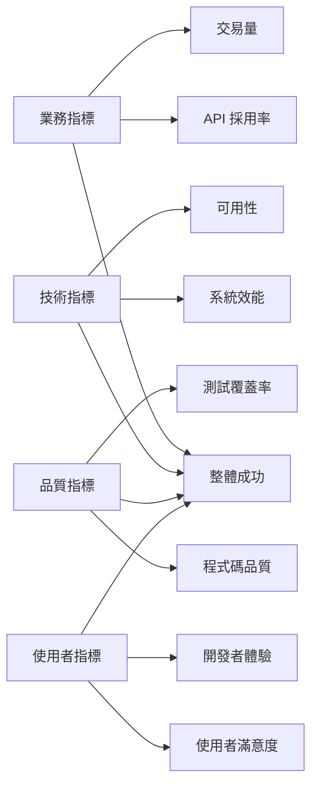

# 成功指標與 KPI 定義

[← 返回文件中心](../README.md) | [需求文件](./README.md) | **成功指標**

## 文件資訊

- **版本**: 1.0.0
- **最後更新**: 2025-08-28
- **目標讀者**: 產品經理、專案經理、開發團隊、業務團隊
- **相關文件**: 
  - [功能需求](./functional.md)
  - [非功能需求](./non-functional.md)
  - [使用案例](./use-cases.md)
  - [監控系統](../operations/monitoring.md)

## 執行摘要

本文件定義 Fake Store API 專案的成功指標和關鍵績效指標（KPI），用於評估專案的實施成效、追蹤進度和指導改進方向。

## 成功指標架構

## 1. 業務成功指標

### 1.1 API 採用率指標

| 指標名稱 | 目標值 | 測量頻率 | 計算方式 | 狀態 |
|---------|--------|---------|---------|------|
| **月活躍開發者數** | > 100 | 每月 | 當月使用過 API 的唯一開發者數 | 追蹤中 |
| **API 呼叫總量** | > 100K/月 | 每日 | 所有 API 端點的呼叫次數總和 | 追蹤中 |
| **新註冊開發者** | > 20/月 | 每週 | 新申請 API Key 的開發者數 | 追蹤中 |
| **API Key 活躍率** | > 60% | 每月 | 活躍 API Key / 總發放 API Key | 追蹤中 |
| **整合應用數量** | > 50 | 每季 | 使用 API 的第三方應用總數 | 追蹤中 |

### 1.2 交易與商業指標

| 指標名稱 | 目標值 | 測量頻率 | 計算方式 | 狀態 |
|---------|--------|---------|---------|------|
| **模擬交易量** | > 1000/月 | 每日 | 完成的支付流程總數 | 追蹤中 |
| **購物車轉換率** | > 30% | 每週 | 結帳數 / 建立購物車數 | 追蹤中 |
| **平均購物車金額** | > $50 | 每週 | 總交易金額 / 交易次數 | 追蹤中 |
| **產品瀏覽轉換率** | > 5% | 每週 | 加入購物車 / 產品瀏覽次數 | 追蹤中 |

### 1.3 教學成效指標

| 指標名稱 | 目標值 | 測量頻率 | 計算方式 | 狀態 |
|---------|--------|---------|---------|------|
| **教學完成率** | > 70% | 每月 | 完成整個教學流程的使用者比例 | 規劃中 |
| **範例使用率** | > 80% | 每月 | 使用範例程式碼的開發者比例 | 規劃中 |
| **文件閱讀時間** | > 15 分鐘 | 每週 | 平均文件閱讀時長 | 規劃中 |

## 2. 技術成功指標

### 2.1 系統效能指標

| 指標名稱 | 目標值 | 警戒值 | 測量方法 | 狀態 |
|---------|--------|--------|----------|------|
| **API 回應時間 (P50)** | < 200ms | > 300ms | Prometheus 監控 | ✅ 達標 |
| **API 回應時間 (P95)** | < 500ms | > 800ms | Prometheus 監控 | ✅ 達標 |
| **API 回應時間 (P99)** | < 1000ms | > 2000ms | Prometheus 監控 | ⚠️ 接近警戒 |
| **吞吐量 (QPS)** | > 100 | < 50 | 負載測試 | ✅ 達標 |
| **資料庫查詢時間** | < 300ms | > 500ms | 查詢日誌 | ✅ 達標 |
| **快取命中率** | > 80% | < 60% | Valkey 統計 | ✅ 達標 |

### 2.2 系統可用性指標

| 指標名稱 | 目標值 | 警戒值 | 測量方法 | 狀態 |
|---------|--------|--------|----------|------|
| **服務可用性 (SLA)** | > 99.5% | < 99% | 監控系統 | ✅ 達標 |
| **平均復原時間 (MTTR)** | < 15 分鐘 | > 30 分鐘 | 事件記錄 | ✅ 達標 |
| **平均故障間隔 (MTBF)** | > 30 天 | < 7 天 | 事件記錄 | ✅ 達標 |
| **錯誤率** | < 1% | > 5% | 日誌分析 | ✅ 達標 |
| **健康檢查成功率** | > 99% | < 95% | Docker 健康檢查 | ✅ 達標 |

### 2.3 資源使用效率

| 指標名稱 | 目標值 | 警戒值 | 測量方法 | 狀態 |
|---------|--------|--------|----------|------|
| **CPU 使用率** | < 60% | > 75% | 系統監控 | ✅ 達標 |
| **記憶體使用率** | < 70% | > 85% | 系統監控 | ✅ 達標 |
| **資料庫連線池使用率** | < 60% | > 80% | 連線池監控 | ✅ 達標 |
| **磁碟 I/O 延遲** | < 20ms | > 50ms | 系統監控 | ✅ 達標 |

## 3. 軟體品質指標

### 3.1 程式碼品質指標

| 指標名稱 | 目標值 | 最低標準 | 測量工具 | 狀態 |
|---------|--------|----------|----------|------|
| **單元測試覆蓋率** | > 80% | > 70% | JaCoCo | ⚠️ 進行中 |
| **整合測試覆蓋率** | > 70% | > 60% | JaCoCo | ⚠️ 進行中 |
| **程式碼複雜度** | < 10 | < 15 | SonarQube | ✅ 達標 |
| **技術債務比例** | < 5% | < 10% | SonarQube | ✅ 達標 |
| **程式碼重複率** | < 3% | < 5% | SonarQube | ✅ 達標 |

### 3.2 安全性指標

| 指標名稱 | 目標值 | 警戒值 | 測量方法 | 狀態 |
|---------|--------|--------|----------|------|
| **安全漏洞數（嚴重）** | 0 | > 0 | SAST 掃描 | ✅ 達標 |
| **安全漏洞數（高）** | < 2 | > 5 | SAST 掃描 | ✅ 達標 |
| **依賴漏洞數** | < 5 | > 10 | Dependency Check | ⚠️ 檢查中 |
| **認證失敗率** | < 5% | > 10% | 日誌分析 | ✅ 達標 |
| **OWASP 合規性** | 100% | < 90% | 安全審計 | ✅ 達標 |

### 3.3 文件品質指標

| 指標名稱 | 目標值 | 最低標準 | 測量方法 | 狀態 |
|---------|--------|----------|----------|------|
| **API 文件覆蓋率** | 100% | > 95% | OpenAPI 檢查 | ✅ 達標 |
| **程式碼註解覆蓋率** | > 80% | > 60% | 靜態分析 | ⚠️ 改進中 |
| **文件更新即時性** | < 1 週 | < 2 週 | Git 記錄 | ✅ 達標 |
| **範例程式碼完整度** | 100% | > 90% | 人工審查 | ✅ 達標 |

## 4. 使用者體驗指標

### 4.1 開發者體驗指標

| 指標名稱 | 目標值 | 測量方法 | 狀態 |
|---------|--------|----------|------|
| **首次整合時間** | < 30 分鐘 | 使用者調查 | 追蹤中 |
| **API 易用性評分** | > 4.0/5 | 開發者問卷 | 規劃中 |
| **文件有用性評分** | > 4.2/5 | 文件反饋 | 規劃中 |
| **SDK 滿意度** | > 85% | 使用調查 | 規劃中 |
| **支援回應時間** | < 24 小時 | Issue 追蹤 | 追蹤中 |

### 4.2 終端使用者體驗

| 指標名稱 | 目標值 | 測量方法 | 狀態 |
|---------|--------|----------|------|
| **頁面載入時間** | < 3 秒 | 前端監控 | ✅ 達標 |
| **操作完成率** | > 90% | 使用者分析 | 追蹤中 |
| **錯誤遇到率** | < 2% | 錯誤日誌 | ✅ 達標 |
| **行動裝置相容性** | 100% | 測試報告 | ✅ 達標 |

## 5. 專案管理指標

### 5.1 開發進度指標

| 指標名稱 | 目標值 | 測量方法 | 狀態 |
|---------|--------|----------|------|
| **功能完成率** | 100% | 需求追蹤 | 85% |
| **Sprint 速率** | 40 點/Sprint | Scrum 追蹤 | 達標 |
| **缺陷密度** | < 5/KLOC | 缺陷追蹤 | 達標 |
| **程式碼審查覆蓋率** | 100% | PR 記錄 | 達標 |

### 5.2 持續改進指標

| 指標名稱 | 目標值 | 測量方法 | 狀態 |
|---------|--------|----------|------|
| **部署頻率** | > 2次/週 | CI/CD 記錄 | 追蹤中 |
| **部署成功率** | > 95% | 部署日誌 | 達標 |
| **回滾率** | < 5% | 部署記錄 | 達標 |
| **Lead Time** | < 2 天 | Git 到生產 | 改進中 |

## 成功指標儀表板

### 即時監控儀表板
- **Grafana Dashboard**: 系統效能、資源使用、API 使用統計
- **SonarQube Dashboard**: 程式碼品質、測試覆蓋率、技術債務
- **Business Dashboard**: 使用者行為、交易統計、轉換率

### 週期性報告
- **日報**: 系統健康狀態、錯誤率、關鍵事件
- **週報**: 業務指標趨勢、開發進度、品質指標
- **月報**: 整體成功評估、改進建議、下月目標

## 指標評估與改進

### 評估頻率
- **即時指標**: 持續監控（效能、可用性）
- **日度指標**: 每日檢視（使用量、錯誤率）
- **週度指標**: 每週評估（進度、品質）
- **月度指標**: 每月總結（業務成效、使用者滿意度）

### 改進行動計畫

1. **紅燈指標**（未達標）
   - 立即分析根因
   - 制定改進計畫
   - 每日追蹤進度

2. **黃燈指標**（接近警戒）
   - 預防性措施
   - 資源調整
   - 週度檢視

3. **綠燈指標**（達標）
   - 持續監控
   - 最佳實踐分享
   - 季度評估調整目標

## 成功定義

### 短期成功（3個月）
- ✅ 核心功能 100% 完成
- ✅ 系統可用性 > 99.5%
- ✅ API 回應時間 < 500ms (P95)
- ⏳ 月活躍開發者 > 50

### 中期成功（6個月）
- ⏳ 月活躍開發者 > 100
- ⏳ API 呼叫量 > 100K/月
- ⏳ 整合應用 > 30 個
- ⏳ 使用者滿意度 > 4.0/5

### 長期成功（12個月）
- ⏳ 成為電商 API 教學標準範例
- ⏳ 開源社群活躍貢獻者 > 20
- ⏳ 被 5+ 個教育機構採用
- ⏳ 月活躍開發者 > 500

## 風險指標

### 需要立即關注的指標
| 風險指標 | 警戒值 | 影響 | 緩解措施 |
|---------|--------|------|----------|
| 錯誤率突增 | > 10% | 使用者流失 | 自動回滾機制 |
| 回應時間惡化 | > 2秒 | 體驗下降 | 自動擴容 |
| 安全漏洞 | 嚴重 > 0 | 資料風險 | 立即修補 |
| 可用性下降 | < 99% | 信任危機 | 災難復原 |

## 相關文件

- [功能需求](./functional.md) - 功能規格與驗收標準
- [非功能需求](./non-functional.md) - 效能與品質要求
- [監控系統](../operations/monitoring.md) - 監控實施細節
- [測試策略](../implementation/testing-strategy.md) - 品質保證計畫

---

*本文件是 Fake Store API 專案的一部分*

*最後更新: 2025-08-28*